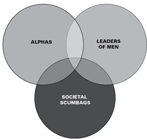

# 一、基础知识

炎症：

对一个人不健康的浪漫痴迷。通常伴随着
无回报的情感和对的完全不切实际的理想化。

脑炎就是瘫痪。你不再成熟，你不再行动，你不再是你自己。

没有人。这就是灵魂伴侣的神话。有好的也有坏的，但是没有一个。任何告诉你其他事情的人都是在卖东西给你。有很多 s 的‘特别的人’在等着你，只要问问离婚/丧偶的人，他们的“灵魂伴侣”死后再婚，或者与另一个人继续生活，他们坚持认为这是他们的真正的灵魂伴侣。

这就是让人们对灵魂伴侣神话感到困惑的地方，这是一个我们至少在某种程度上都有一个理想化的幻想——我们每个人都有一个完美的伴侣，一旦行星对齐，命运顺其自然，我们就会知道我们彼此是有意。虽然这可能是一个令人满意的浪漫喜剧情节，但这并不是一个现实的生活规划方式。事实上，它通常会瘫痪。

我发现更令人着迷的是，（尤其是对于男性而言）一种非常普遍的想法，即在性关系领域，这种幻想应该胜过对生活的疯狂看法。

认识到理解心理学、生物学、社会学、进化论、商业、工程学等的价值的男性，对我们日常生活中看到的这些方面的相互作用有着具体认识的男性，是第一批强烈反对可能没有这种想法的男性“每个人都有人”或者说还有更多的人可以达到或超过我们下意识为他们设定的标准。

我认为这是一种虚无主义，或者说他们对这种信仰的自我投资是错误的恐惧——就像对虔诚的宗教信徒说“上帝死了”。这太可怕了，无法想象可能没有人，或者有几个人可以共度一生。这个西方浪漫化的神话是基于这样一个前提，即任何一个人只有一个完美的伴侣，并且一生都可以而且应该花在不断寻找这个“灵魂伴侣”上。这个神话在我们的集体意识中如此强烈和普遍，以至于它已经类似于一个宗教宣言，事实上，随着西方文化女性化的蔓延，它已经融入了许多宗教教义。

我认为这是一种非典型肺炎。有必要区分基于相互亲和力和尊重的健康关系和基于不平衡的关系。我已经有不止几个人征求我的意见，或者挑战我对 ONEitis 的看法，基本上是请求我同意接受 ONEitis 作为合法的一夫一妻制。

“但是罗洛，一个男人为他的妻子或女朋友做一件事是可以的。毕竟她是他唯一的，对吧？”

据我估计，孤独症是一种不健康的心理依赖，是我们集体意识中灵魂伴侣神话持续社会化的直接结果。真正可怕的是，ONEitis 已经成为长期关系（LTR）或婚姻的健康规范方面。

我得出结论，OneIts 基于社会学根源，这不仅是因为它是个人信仰的陈述，而且是因为这种意识形态通过媒体、音乐、文学、电影等在流行文化中传播和大众营销的程度。

像 eHarmony 这样的约会服务无耻地推销和利用这种动力所产生的不安全感，这种不安全感正是人们在拼命寻找“他们想要的”对象时产生的。男人拥有自然的保护能力的想法，供应和半一夫一妻制从社会和生物心理学的角度来看都有优点，但一夫一妻制精神病并不是它的副产品。相反，我会将它与这种健康的保护者/提供者动态区分开来，因为 ONEitis 本质上破坏了我们的自然倾向，否则就会过滤掉。

一个人单身时乱跑是一种不安全感，在 LTR 中，当与目标结合时，可能会瘫痪。驱使一个人满足于自己的目标（无论健康还是不健康）的同样的神经质绝望，是同样的不安全感，使他们无法放弃破坏性的关系——这是他们的目标，没有他们，他们怎么能生活？或者，他们是我的唯一，但我所需要的是修复我自己或修复他们，以拥有我理想化的关系。

这种关系的理想化是 ONEitis 的根源。有了这样一种有限的、全有或全无的二元方法来大海捞针，并在一生中投入情感上的努力，我们如何成熟到对这种关系真正应该包含什么的健康理解？正是这种乐观的、理想化的关系——即“永远幸福”——相信一个人是最终的目标，却被不断追求一个人所付出的代价所挫败和矛盾。在一生中的大部分时间都投入到这一意识形态中之后，要意识到与他们在一起的人不是他们的人会有多困难？为了保护这种自我投资的一生，一个人会达到什么程度？

在 ONEitis 关系中的某个时刻，一个参与者将基于 ONEitis 所必需的无力建立支配地位。对于一个女人来说，没有什么比毫无疑问地知道她是男人性和亲密需求的唯一来源更重要的了。ONEitis 思维模式只能将这一点融入双方的理解中。对于一个人来说，他相信自己投入的感情和心理上的破坏性关系是他一生中唯一能与之相处的人，在他的成熟过程中没有什么比这更让他瘫痪了。当然，女人也是如此，这就是为什么当我们看到一个特别漂亮的女人追回她虐待和冷漠的混蛋男友时，我们会摇头，因为她相信他是她唯一的安全来源。超多情可能是她坚持和他在一起的根本原因，但正是灵魂伴侣的神话，对“逃跑的人”的恐惧，使得她在情感上，几乎是精神上做出了投资。

权力的定义不是经济上的成功、地位或对他人的影响，而是我们对自己生活的控制程度。认同灵魂伴侣神话，我们必须认识到在我们生活的这个舞台上的无能为力。我认为最好是培养一种健康的认识，即没有人。有一些好的，也有一些坏的，但是没有一个。

灵魂伴侣的宗教

你刚才读到的是我在 SoSuave 论坛上最早的帖子之一，大约在 2003-04 年。当时我正在完成我的学位，有一天，我在心理学课上用图表说明了这个谬误。当时我在课堂上，周围（大部分）都是比我年轻得多的学生，他们都非常机敏，像 20 多岁的孩子一样聪明。在某一点上，讨论转向了宗教，班上的许多人表示自己是不可知论者或无神论者，或“精神的，但不是宗教的”。其基本原理当然是，宗教和信仰可以解释为扩展到社会学动力学的
心理（死亡恐惧）结构。

后来在那次讨论中，出现了“灵魂伴侣”的想法。教授实际上并没有使用“灵魂”这个词，而是通过要求学生举手表示他们相信“有一个特别的人在等着他们？”或者他们害怕“那个逃走的人”。几乎全班学生都举手了。尽管他们的理性经验主义和在灵性方面对现实主义的诉求，他们（几乎）一致表达了一种准业力信念，即与另一个理想化的人在亲密的层面上联系一辈子。

即使是兄弟会的男生和勾搭女生，我知道他们的约会习惯中并没有明确地寻找任何长期的东西，他们仍然举手表示同意。一些人后来解释了这一点对他们意味着什么，大多数人对这种理想化有不同的定义——一些人甚至承认随着讨论的进行这是一种理想化——但几乎所有人仍然对“缘分”持有非理性的信仰，甚至是最不具精神的信仰，这只是生活的一部分，与一个重要的人结对，并且“每个人都有一个人”。

这场讨论是我觉醒意识之一的催化剂——尽管有各种各样的可能性，人们基本上觉得有资格或应该得到他们生命中重要的爱。

从统计学和实用角度来看，这都是荒谬的，但事实确实如此。这一核心概念的女性化已经被浪漫化和商业化，以至于它成为一种宗教，甚至对于那些明确不信教的人来说也是如此。莎士比亚对一个人的渴望，对另一个注定与我们相配的灵魂（伴侣）的追求，已经被系统地扭曲了。正如我稍后将详细阐述的，男人会在失去灵魂伴侣的错觉中自杀。

灵魂伴侣男人

这种对灵魂伴侣神话的曲解，很大程度上归因于我们今天所面对的女性化社会习俗。害怕与我们想象中的灵魂伴侣隔绝，或者害怕无法挽回地失去对我们来说“完美的一个”，这助长了我们在当代社会母体中发现的大量个人和社会神经官能症。例如，孤独老人神话中固有的许多恐惧在没有灵魂伴侣神话核心信仰的情况下会失去牙齿。只有当男人认为公平应该影响的人是他们命中注定的人时，对损失的恐惧和对关系公平的错觉才真正重要。

女性命令意识到灵魂伴侣神话从兴起之初就对男性（和女性）具有压倒性的力量，成为主要的性别社会命令。事实上，核心灵魂伴侣动态的所有扭曲都演变为男性的控制模式。当灵魂伴侣女性是灵魂伴侣男人的主要奖励时，就有很多机会巩固这种力量。要清楚的是，不要认为这是一个以 fem 为中心的阴谋集团社会工程的恶魔阴谋，灵魂伴侣害怕进入男人。一代又一代的男人，在成长过程中被遗忘了，他们自愿并积极地帮助灵魂伴侣神话永存。

灵魂伴侣女性

尽管超多情在决定女性理想化灵魂伴侣的因素中起着重要作用，但她们也无法避免这种核心恐惧的利用。虽然这与其说是一种彻底的操纵，不如说是一种不幸的副产品，但我认为，在某种程度上，多情会加剧这种神经症。阿尔法遗孀非常清楚思念失去的阿尔法所带来的痛苦——特别是当她在性市场价值（SMV）下降后与尽职尽责的贝塔供应商长期配对时。

对于女性来说，灵魂伴侣代表着一种几乎无法实现的组合，即激发阿尔法支配力，与忠诚的守护者相匹配，以获得长期的安全感，只有她能从他身上驯服。

超多情讨厌灵魂伴侣原则，因为灵魂伴侣是一个绝对的定义，而超多情必须始终测试完美。超多情问，“他就是那个吗？他就是那个吗？”灵魂伴侣神话回答，“他必须是那个，他是你的灵魂伴侣，而且只有一个。”

打造神秘

由于这一核心概念和灵魂伴侣神话，两性都会为自己寻求完美的理想化——即使是在最不理想的条件和表达方式下。
我们希望将我们的亲密关系建立在灵魂伴侣的理想主义中，以缓解恐惧并解决问题，而大多数情况下，我们会巧妙地忽略警告、虐待和这样做的后果。对于女性来说，最重要的阿尔法男性的影响最初定义了灵魂伴侣的理想化。对于男人来说，它可能是第一个与他发生性关系的女人，或者是他（错误地）认为可以以男性定义的爱的方向来爱他的女人的最好例证。

然而，这些是建立灵魂伴侣理想的起点。然后，这一理想与层层投资结合在一起，希望这个人“实际上可能是命运为他们规定的人”。情感投资、个人投资、财务投资，甚至是生命潜在投资和牺牲，然后努力创造一个灵魂伴侣。在缺乏理想的情况下，必须从可用资源中创建理想。

这个过程就是为什么我说灵魂伴侣神话是荒谬的——从心理上来说，构建另一个人来满足这个理想比“等待命运的安排”要实际得多。认同这个神话的人宁愿构建一个灵魂伴侣，后果将是可恶的。因此，女性会试图建立一个更好的贝塔，或驯服一个阿尔法，而男性会试图把一个妓女变成一个家庭主妇，反之亦然。

觉醒于红色药丸真理的最苦涩的回味之一是抛弃旧的范式，换成新的范式。我以前说过这类似于杀死一个老朋友，而一个需要杀死的朋友正是这个神话。让自己摆脱这种核心恐惧对于将自己完全从旧范式中拔出至关重要，因为以有限元为中心的社会条件作用很大程度上依赖于它。

抛弃灵魂伴侣的神话并不是很多人都认为的虚无主义。如果有什么不同的话，它会让你与一个对你来说真正重要的人有一个更好、更健康的未来关系——一种基于真诚的渴望、相互尊重、相互的理解和爱的关系，而不是一种基于害怕失去你生命中唯一的满足感的关系。在任何关系中，权力最大的人是最不需要对方的人。

这是任何关系的基础，不仅仅是两性间的关系，而且是家庭、商业等关系。这是一种始终有效的动态。为了我自己和我家人的幸福，我需要我的雇主比他更需要我，因此我早上起来为他工作。虽然我对他的公司和事业的持续发展也是至关重要的，但他对我的需求比我对他的需求要少。现在我可能明天中彩票，或者他可能决定削减我的工资或限制我的福利，或者我可能完成我的硕士学位，并决定我可以做得更好，而不是让自己无限期地束缚在他的车上，因此，通过某种条件，无论是我自己发起的还是没有发起的，我对他的需求比他对我的需求要少。在这一点上，他被迫决定我对他的雄心壮志有多大价值，或者与我分道扬镳，或者通过谈判促进我们的关系。

中间性关系也是如此。你是否想把你的关系建立在“权力”的基础上不是问题；从你的第一个吸引点就已经开始了。她可以接受你满足任何标准，她也满足你自己的标准。如果不是这样的话，你就不会建立一种相互的关系。在任何关系中，权力最大的人就是的人

最不需要对方。

这是任何关系的基础，不仅仅是两性间的关系，而且是家庭、商业等关系。这是一种始终有效的动态。

为了我自己和家人的幸福，我需要我的雇主比他更需要我，所以我早上起床为他工作。虽然我对他的公司和事业的持续发展也是至关重要的，但他对我的需求比我对他的需求要少。现在我可能明天中彩票，或者他可能决定削减我的工资或限制我的福利，或者我可能完成我的硕士学位，并决定我可以做得更好，而不是让自己无限期地束缚在他的车上，因此，通过某种条件，无论是我自己发起的还是没有发起的，我对他的需求比他对我的需求要少。在这一点上，他被迫评估我对他未来雄心壮志的必要性，要么与我分道扬镳，要么谈判进一步发展我们的关系。

中间性关系也是如此。你是否想把你的关系建立在“权力”的基础上不是问题；从你的第一个
吸引点开始，它就已经开始发挥作用了。她可以接受你满足她的任何标准，她也满足你自己的标准。如果不是这样的话，你就不会建立一种相互的关系。这是我们与另一个人进行的第一次比较——如果你愿意，可以称之为“评估”——但我们对一切都进行先天（通常是无意识）比较，在最初的吸引情况下，我们决定对方是否可以接受我们的亲密关系。

这一原则与其说是关于“权力”，不如说是关于控制。这听起来像是语义学，但却有区别。很容易陷入二元争论，认为我所说的关系的基本规则是，一个参与者必须绝对统治另一个参与者——一个专横的支配者，一个顺从的门垫。我们对权力的现代解释的问题是，用极端、绝对的术语来看待权力。

在健康的关系中，控制力会随着欲望和需求对每个伴侣的支配而来回传递。在一段不健康的关系中，你的伴侣对这种控制的操纵是不平衡的。虽然控制从来都不是完全平衡的，但当一方在本质上敲诈另一方时，控制就变成了操纵，而在健康的环境下，另一方则会成为被操纵者的强化者。 

这种情况的发生有太多不同的原因，但这种情况是通过两种方式产生的——顺从的参与者变得习惯于允许操纵发生和/或支配者发起操纵。在这两种情况下，这一规则仍然适用——最不需要对方的人拥有最多的控制权。这在人际关系中最为明显。

我咨询和阅读过我博客的太多人认为，这一规则意味着我主张以牺牲伴侣的最佳利益为代价维持支配地位；远非如此。然而，我确实主张人们——特别是年轻人——培养更好的自我价值感，更好地理解他们在人际关系中的真正功效（假设你决定参与其中）。

别误会我，两性都有操纵罪；被殴打的女性会回到虐待她们的男朋友/丈夫身边，而被女人鞭打的男性则会妥协自己和她们的雄心壮志，以便更好地为她们的女朋友服务。我推广这一规则的目的是让那些已经倾向于贬低自己、将女性作为人生目标的年轻男性睁开眼睛，而不是将自己视为追求的 prize。妥协永远是任何关系的一部分，但关键是要意识到当妥协成为操纵的结果时，实际上是什么，并在这些情况下培养不妥协的信心。在这一点上，坚定地理解关系的基本规则变得至关重要。

放弃与女友的争吵没有什么错，但如果你为了“保持和平”而不断地妥协，并理解到她会因为你坚持自己的立场而拒绝与你保持亲密关系，那就错了。这是一个权力游戏，也被称为“t”。

她发起了它，从而成为控制方。没有一个女人的亲密关系（即性）值得这样的妥协，因为这样做会贬低你对她的价值。

一旦树立了这个先例，她对你的尊重就会逐渐减少——这与流行的观念正好相反，即她会欣赏你为她做出的妥协，并为此奖励你。事实上，为了实现目标，你在妥协什么？在这种情况下，你是在寻求她的亲密。这不是对你真正的渴望或真正的兴趣，而是一种微妙的心理测试（太多男人都不知道），旨在确定谁更需要对方。对于一个男人来说，没有比自己更自信的了，因为他知道自己不会为一个女人公认的操纵而妥协，知道自己过去有过，将来也会找到比她更好的前景，他会毫不犹豫地走开。这就是那个通过狗屎测试的人。这叫做“开明的私利”，我完全赞同这一原则。

真理对权力

否认权力的效用，诋毁权力的使用，本身就是一种使用权力的手段。

真正的改变是由内而外的。如果你不改变你对自己的看法，你就不会改变其他任何事情。女性可以随心所欲地改变自己的头发颜色、妆容、衣服、胸围以及任何数量的化妆品，或者在她们负担得起的情况下，但她们不断抱怨的不满和不足之处植根于她们的自我认知，而不是别人对她们的真实看法。

这是一种由外而内的心态；希望外在能改变内在，而正是这种心态让弱小的人适用于自己——唯一的区别就是应用。

普通沮丧的傻瓜（AFC，因为没有更好的术语）和虚荣的女人（好吧，真的是任何女人）有着同样的问题——对自己的问题缺乏真正的自我理解。进行自我分析和自我批评是非常困难的，特别是当涉及到质疑我们自己的信仰和我们的个性是什么的原因时。这类似于告诉某人他们的生活不“正确”，或者他们抚养孩子是“错误的”；只是这更难，因为我们在向自己讲述自己。

自我评价（非自尊）内维 r 是自发发生的，总有一些危机会促使它发生。焦虑、创伤和危机是激发自我意识的必要催化剂。分手，死亡，背叛；可悲的是，正是在我们生命中的这些时刻，我们做了最好的内省，我们有了“清晰的时刻”，是的，我们发现了自己被塑造成了什么样的深不可测、傻笑的傻瓜。

拒绝

真正摆脱预处理（即女性矩阵）的第一步是认识到这种预处理导致了我们认为是我们个性不可或缺的信念。心理学术语称之为“自我投资”。当一个人如此彻底地将一种心理图式内化，并长期习惯于它时，它就成为他们人格的一个组成部分。因此，攻击信仰就是，从字面上说，攻击人。这就是为什么我们看到人们对政治、宗教、社会间/性别间、性别间等信仰表达的强烈反应。他们认为这是一种人身攻击，即使面对挑战这些信仰真实性的无可辩驳的实证证据。

有游戏意识的男性表达的一个常见挫折是，很难打开 AFCs 的眼睛，了解为什么他没有约会，为什么他没有约会（如果是第二次约会的话），为什么他总是被“让我们做朋友”（LJBF）拒绝，等等，以及真正的自我投资内在化的所有缺陷。正如我喜欢说的，从矩阵中拔出傻瓜是一件肮脏的工作，当一个人处于绝对否认的状态时，这就变得更加困难。

当人们意识到真相会摧毁他们所珍视的东西时，就会采取否认的态度。如果是一个不忠的伴侣，否认会让你避免承认自己受到羞辱的证据。除了抓到配偶和你最好的朋友在床上，不忠的证据通常是模棱两可的。这是出于怀疑的动机。你对自己不想相信的事情更加怀疑，并要求更高水平的证据。否认是无意识的，否则是行不通的：如果你知道你对真相视而不见，你的某些部分就知道真相是什么，而否认就不能起到保护作用。

我们都努力保护的一件事是积极的自我形象。你的自我形象中受到真相挑战的方面越重要，你就越有可能否认。如果你有强烈的自我价值感和能力，你的自我形象会受到打击，但基本上保持不变；然而，如果你被自我怀疑（自以为是的 AFC 思维的标志）所困扰，任何对失败的承认都可能是毁灭性的，任何对错误的承认都会痛苦到无法想象的地步。自我辩护和否认产生于相信自己有能力和犯错误之间的不和谐，这与这种形象相冲突。

解决方法：否认错误。将其归因于外部因素（女性不会按照“规则”行事），而不是诉诸内省（也许我对“规则”的理解是错误的）。

因此，我们看到 AFC 在他们的方法中顽强地坚持一种道德目的感，而这一点只有在我们的媒体、我们的音乐、电子和声、我们的宗教等流行文化中才能得到加强。

权力条款

权力一词有很多误用的含义。当我们想到有权势的人时，我们想到的是影响力、财富、威望、地位和让他人为我们服务的能力——所有这些都不是权力。尽管我们想说服自己，女性被这对权力的定义所吸引，但这是错误的。因为我在这里描述的权力的各个方面实际上是权力的表现。

这里有一个宇宙秘密向你揭示：

真正的权力是一个人对自己环境的控制程度。真正的力量是我们实际控制生活方向的程度。

当我们允许我们的思维、我们的人格障碍和我们的心理图式以及它们伴随的行为来决定我们的决策过程时，我们就放弃了真正的权力。通过武力或意志屈服于社会、婚姻、承诺、家庭、父亲身份、职业选择、军队等要求他承担的责任、责任和义务的人，对他自己的一生几乎没有影响。

画家保罗·高更是历史上最有权势的人物之一。保罗在中年时是一位“成功的”银行家，有妻子和孩子，从表面上看，他是一位功绩卓越、财富可观的人。后来有一天，保罗觉得他已经受够了，想画画。他离开了妻子、孩子和金钱，决定当一名画家。他抛弃了以前的生活，过着自己选择的生活，他有能力掌控它。最终，他死在了塔希提岛，但不是在经历了最有趣的生活之一并成为世界著名画家之后。

你可能会想，他是多么可怕的人，他放弃了自私地追求自己的欲望的责任，但事实仍然是，他有自己的权力，这样做，大多数人会战栗甚至胡想。我们被自我期望和自我限制所束缚，以至于我们看不到我们一直拥有通往自己监狱的钥匙——我们只是害怕使用它们。

这种力量是所有重要术语“信心”的根源，每当我们告诉一个 19 岁的笨蛋女人真正想要什么，他就能得到性生活时，我们就会抛弃这个词。正是这种能力使我们能够做出自己的决定，无论是对是错，并自信地拥有这些决定，从而将我们与“其他人”区分开来。正是这种自我引导的力量唤起了一种看似非理性的信心，使我们能够旋转盘子，迄今为止，非排他性地坚持自己，并且不怕让自己成为奖，而正是这种力量，女性希望与之联系在一起。

正是由于缺乏这种能力，大师们才开始接触艺术家（PUAs）一旦她们参与了 LTR，就回到一些最可怜的 AFC。她们向女性推销这种理想化和她们拥有这种权力的观念，而这种权力只是为了发现 AFC 的不安全感——一旦她们购买了该法案，这些行为就意味着要掩盖这种不安全感。这并不是贬低 PUA 技能作为有效的行为集的价值，而是为了说明在实现真正的个人改变时应该表现出来的行为。因此，采用积极的男性心理模式会促进这些 PUA 技能。相反，我们在疯狂的追逐中本末倒置，通过用死记硬背的 PUA 技术来掩盖我们在实际能力和理解能力方面的不足，希望通过练习它们，它们将变成“自然游戏”，从而获得我们被剥夺了这么长时间的所有重要的性器官我们将足够成熟，开始一场持久的个人变革。

我们稍后再回到这里。

灵魂伴侣神话

没有人

第一章

关系的基本规则

你不能谈判真正的愿望。

这是一个非常简单的原则，大多数男人和绝大多数女人都故意不知道。在过去的 10 年里，我被问到的一个最常见的个人问题是“我怎样才能让她回来？”的一些变体。通常，这些问题会分解为男性寻求某种方法，将他的关系恢复到一种早期状态，在这种状态下，一个先前充满激情的女性无法把手从他身上移开。六个月后，一种舒适的熟悉感和兴奋感消失了，但事实上，真正的欲望消失了。

在这个阶段，男人往往会诉诸谈判。有时，这可能是微妙的，因为他循序渐进地、系统地为她做事情，希望她能以他们过去同样的性/亲密热情回报。另一些时候，一对已婚或长期伴侣可能会去婚姻咨询处“解决他们的性问题”，并就她的性依从性条款进行协商。他会答应更频繁地洗碗和洗衣服，以换取她假装对他感兴趣。然而，无论提供什么条件，无论他做出多么值得回报的外在努力，真正的渴望都不在她身边。事实上，在做出了这些努力之后，她因为没有欲望而感觉更糟。她的愿望已成为一种义务。

协商的愿望只会导致有义务的服从。这就是为什么她在谈判后的性反应往往如此平淡无奇，也是他进一步沮丧的原因。她可能对他更容易性交，但这种半心半意的经历与他们第一次见面时不同，当时没有谈判，只是自发地渴望对方。

从男性的角度来看，尤其是对于一个不熟悉的贝塔男性来说，欲望谈判似乎是一个演绎的、理性的问题解决方案。男人天生倾向于依赖演绎推理；否则称为“if-then”逻辑流。代码通常是这样的：

我需要性+女人拥有我想要的性+询问女人的性条件+满足性的先决条件=我想要的性。

有道理，对吗？这是一个简单的演绎实用主义，但建立在一个依靠女性准确的自我评价的基础之上。他们在关系开始时所经历的真正愿望是建立在一组完全未知的变量之上的。

公开表达对互惠愿望的渴望会产生义务，有时甚至是最后通牒。真正的欲望是一个人必须自愿达到或被引导到的。你可以用威胁的方式强迫一个女人遵守你想要的行为方式，但你不能让她想要那样做。妓女会为了交换而操你，这并不意味着她想要去。

无论是一夫一妻制婚姻、LTR 还是一夜情（ONS），在你们的关系中争取真正的欲望。

一半的战斗是知道你想和一个想取悦你的女人在一起，而不是一个觉得有义务的女人。你永远不会通过公开的方式从她那里获得这种真正的欲望，但你可以秘密地引导她达到这种真正的欲望。激发真正欲望的诀窍在于让她不知道你想要激起欲望的意图。真正的欲望是由她认为这是她想要的，而不是她必须做的事情而产生的。

欲望动力

女人的想象力是你游戏中最有用的工具。每一种技巧、每一个随意的反应、每一个手势、暗示和次交流都取决于激发女性的想象力。竞争焦虑依赖于此。证明更高价值（DHV）依赖于它。刺激性紧张依赖于它。如果你愿意，可以称之为“给仓鼠喝咖啡”，但刺激女人的想象力是你在任何一段关系中都能培养出来的最有力的天赋。

这是普通失意傻瓜最大的失败；他们吐出关于自己的一切，向女性透露自己的全部真相，错误地认为女性渴望真相，以此作为获得亲密关系的基础。

现在就学习：女性从未 r 想要完全披露。对于一个女人来说，没有什么比认为她完全基于她神话般的女性直觉（即想象）而认识了一个男人更能让她自我满足的了。

当一个男人公开确认他的性格、故事、价值观等时，对于一个女人来说，神秘感就被驱散了，她从想象、猜疑、自我肯定中享受的生物化学快感也就消失了。大多数男人在第一次约会的时候都会这样做，他们想知道为什么第一次约会后会马上得到 LJBF，这就是为什么。熟悉是反诱惑的。没有什么比舒适的熟悉度更能扼杀游戏、激情和性欲了。尽管女性通常采用阻挠手段，但她们不想与潜在（或已证实的）性伴侣相处融洽，她们需要激发她们的想象力，使其兴奋、兴奋并渴望与潜在伴侣发生性关系。

在 LTR 中，更重要的是需要不断激发想象力。我甚至会说，健康的关系是必不可少的，但你会问，当你的 LTR 女友或妻子已经知道你的故事，并且熟悉的关系变得更加牢固时，你会怎么做？

简单的答案是永远不要让它从一开始就存在——你可能接受的任何 LTR 的健康状况都取决于你进入它的框架。健康的 LTR 的基础是在你单身和约会的时候打好的。我还没见过一个男人，他告诉我，在他的 LTR/婚姻/同居状况建立后，他越来越频繁，越来越激烈的性行为。

这其中的主要原因是竞争焦虑的缓解，这使得
在约会阶段放纵性欲做爱的紧迫感成为让你对她的身体做出承诺的必要条件。这是很多男人失败的关键所在，他们在承诺 LTR 之前放弃了帧。他们相信，（由于女性的条件反射），承诺需要默许她的帧控制，并且是同义词。再加上反诱惑的熟悉感和你自身价值观的日益普遍性，你就能明白为什么她的性兴趣会减弱。

那你怎么做才能防止这种情况？

首先，了解你进入 LTR 的框架是 LTR.的基础，如果你发现自己购买了一个“它的女人世界，我们只是生活在其中”的心态，你默认的推定是，承诺意味着她赢得了默认，你输了，这就是它，甚至不考虑一个 LTR。她进入你的世界，而不是相反。

其次，在 LTR 之前和进入 LTR 之前，你需要培养一种不可预测的因素。永远记住，完美是 boring。女人们会为想要可靠的先生大哭一场，然后去干令人兴奋的先生。在 LTR 中，两者都有必要，但不能以牺牲另一个为代价。太多的已婚男人害怕和他们的妻子或 LTR 一起玩刺激的游戏，因为他们的性生活在安抚她和她已经预设好的身体的平衡中。她必须每天提醒你为什么你有趣、不可预测、令人兴奋，不仅对她如此，对其他女人也是如此。这就需要暗地里、机智地、明显地暗示其他女人会喜欢你。女人渴望来自怀疑和愤怒的化学反应。如果你不提供，他们会很高兴地从小报、爱情小说、风景、泰拉·班克斯或其他通过单身女朋友替代生活的地方得到。

通过顽皮地保持她的冲动来源，你可以保持激发她的想象力的位置。已婚男人在结婚前就被击败了，他们不认为游戏的元素适用于婚姻是因为害怕打乱他们妻子的框架，而事实上，当他们自大&有趣时，游戏的负面影响和许多其他方面都非常有效。

有时候，只是踢她的屁股或者打爆她的排骨，开玩笑地，就足以传达出这样的信息：你不怕她的反应。你可以用骄傲和随之而来的想象打破她的框架。

打破既有的、可预测的熟悉感通常是激发她的想象力的好方法。已婚男性会报告他们的妻子在长期失业（或第一次失业）后，在健身房开始锻炼后的性行为。这很容易被忽略，因为看起来更好会让女人更兴奋（这是真的），但在这下面是一种模式的打破。只要你身材矮胖、无精打采，你就可以控制和预测——其他女人会想要你吗？但是，开始改变你的模式，塑造自己，赚更多的钱，获得晋升，以某种可感知的方式提高和展示你的更高价值，想象力和竞争焦虑就会回来。

想象力

几个世纪以来，女性一直使用各种方法和社会习俗来确保挑选出最佳男性基因，并通过她能够吸引的最佳男性资源来确保其安全。理想情况下，最佳男配角应该是两者的典范，但这两者很少存在于同一个男性身上（尤其是现在），因此为了实现她的生理使命，并出于对安全的内在需求，女性作为一个整体必须发展社会习俗和方法（随着她的环境和个人条件的变化而变化）从而影响到这一点。不仅男性面临女性基因的挑战，而且在人类能够准确确定基因起源之前，已经建立和适应了数百年的女性社会习俗。

在我的许多博客文章中，我都详细说明了择偶是一种心理生物学功能，几千年的进化已经将这种功能牢牢地固定在两性的心理中。这一过程如此内化和社会化到我们的集体无意识中，以至于我们很少意识到我们受制于这些激励因素，即使我们反复表现出这些激励因素所引发的相同行为（例如，女性与阿尔法坏男孩生了第二个孩子）。

简单的演绎逻辑是，一个物种要生存，就必须为其后代提供尽可能好的条件以确保其生存——或者以确保生存的数量繁殖。对女性来说，这一点最明显的应用是与她能吸引的最好的伴侣分享父母的投资，他们能为她和任何潜在的后代提供长期的安全保障。

因此，女性在生物学、心理学和社会学上都是自身生殖的过滤器，而男性的生殖方法是将其尽可能多的遗传物质分散到最广泛的性可用女性群体中。当然，他有自己的择偶标准，也有自己决定繁殖最佳基因配对的标准（即“她一定很性感”），但他的标准肯定比女性的标准更具歧视性（即“凌晨 2 点后没有人难看”）。这在我们自己的荷尔蒙生物学中得到了证明；健康男性的睾丸激素（性唤起的主要激素）是女性的 12 到 17 倍，女性比男性产生更多的雌激素（有助于性谨慎）和催产素（培养安全感和养育感）。

如上所述，这两种方法在实践中存在冲突。对于一个女人来说，为了最好地保证她的后代的生存，一个男人必须放弃自己的繁殖方式，转而选择自己的繁殖方式。这就为他设置了一个矛盾的必要条件，让他和一个能满足他的方法论的女人结对。男性必须牺牲自己的生育计划来满足与之配对的女性。因此，在他面临如此巨大的遗传风险的情况下，他不仅想确保她是育种（和未来育种）的最佳候选人，还想知道他的后代将从父母双方的投资中受益。 

旁注：这种心理-生物动态的一个有趣结果是，男性能够比他们的母亲更快、更敏锐地在一群其他孩子中发现自己的孩子。研究表明，与孩子的母亲相比，在一屋子穿着相同制服的孩子中，男性能够更快、更准确地识别自己的孩子。这再次强调了这种基因权衡的潜意识重要性。

这些是人类性选择和生殖的雏形。显然，还有许多其他的社会、情感和心理复杂因素与这些基本因素有关，但这些都是潜在的动机和考虑因素，潜意识地影响着性选择。

社会约定

为了对抗这种潜意识动力，使其具有自身的遗传优势，女性启动社会习俗和心理模式，以更好地促进自己的繁殖方法。这就是为什么女性总是拥有“改变想法的特权”，最变化无常的行为在社会上是可以原谅的，而男性的行为则被限制在更高的责任标准上，即“做正确的事情”，这对女性的生殖策略总是有利的。这就是为什么那些“玩家”的男人，那些为了追求与生俱来的生殖方式而抛弃母亲的父亲，以及那些在经济、情感和生活决策上无私地牺牲自己的父亲，甚至为了他们没有父亲的孩子的利益，她们被认为是遵守女性基因要求的社会英雄。

这也是女性特有的社会动态的根本动机，如“让我们做朋友”（LJBF）拒绝和女性的受害倾向（正如他们所了解的，这会为男性的生育计划——Cap'n Save a Ho）甚至婚姻本身产生“救世主”心理模式。

好爸爸 vs.好基因

女性在自己的研究方法中要克服的两个最大困难是，她们只在很短的一段时间内（通常是 20 岁出头）处于性生活的高峰，而事实上，成为一个好的长期伴侣（好爸爸）的品质和成为一个好的家畜（好基因）的品质只有很少在同一个男性身上表现出来。供应和安全潜力是与好父亲结对的绝佳动力，但与更能体现基因的男人相比，使他成为好父亲的相同特征通常是一个劣势，身体上的吸引力和冒险的品质使她的孩子具有更好的适应环境的能力（即比其他人更强、更快、更具吸引力，以确保她自己的遗传物质传给后代）。从进化的角度来看，这是一个“混蛋对好人”的悖论。

男人和女人天生（尽管无意识地）理解这种动态，因此为了让女人拥有好爸爸所能提供的最好的东西，同时利用好男人所拥有的最好的基因，她必须发明并不断修改社会习俗，以保持对她生理有利的优势，并符合她多元化的性策略。

生殖计划

这种悖论使得女性（默认情况下男性）必须接受短期和长期的交配计划。短期计划有助于优良基因雄性的繁育，而长期繁育则由优良基因雄性保留。这种习俗和伴随它而来的心理社会图式正是为什么女性会嫁给一个好男人，稳定，忠诚，（最好是）医生，并且仍然操着她在春假遇到的游泳池男孩或可爱的冲浪者。在我们的基因史上，拥有良好基因的男性意味着有能力成为一个好的供养者，但现代习俗阻碍了这一点，因此必须为女性开发新的社会和心理模式。

作弊

为了这种动态性和享受两种基因世界最佳状态的实用性，女性觉得有必要“欺骗”。这种欺骗可以主动或被动地进行。

在反应模型中，已经与长期伴侣选择配对的女性，与短期伴侣（即欺骗的妻子或女友）进行婚外恋或额外配对、性交。这并不是说这个短期的机会不可能发展成第二个、长期的伴侣，但不忠行为本身是一种比忠诚的男性提供者能够提供的更好的遗传资源的方法。

主动出轨是单身妈妈的两难选择。这种形式的“欺骗”依赖于一个女人与一个好的基因男性一起繁殖，生下他的孩子，然后抛弃他，或者让他抛弃她（同样是通过虚构的社会习俗），以便找到一个好父亲男性来供养她和她的好基因伴侣的孩子，以确保他们的安全。

我想再次强调，（大多数）女性没有一些有意识地构建和认可的总体计划来实施这一周期，并故意将男性引入其中。相反，这种行为的动机以及为证明其合理性而发明的相应社会理论是一个无意识的过程。在很大程度上，女性没有意识到这一动态，但仍然受到其影响。对于任何物种的女性来说，为了促进与最佳遗传伴侣的繁殖方法，她能够吸引和来确保自己和她的后代与最佳遗传伴侣一起生存，这是一个进化中的大奖。

绿帽子

在某种意识水平上，男性天生就感觉到这种情况有问题，尽管他们可能无法在女性对其理由的困惑中找到自己感觉到或误解的原因。或者他们因“做正确的事情”的社会压力而沮丧，羞愧地成为殉道者/救世主，并假装对这些公约负责。尽管如此，一些人认为避开单身母亲已经足够好了，无论是通过以往的经验还是通过观察其他男性戴绿帽子，这些男性戴绿帽子肩负着抚养和提供另一个男人与这个女人成功繁殖的责任——无论是如何参与还是不参与。

男人经常扮演积极或被动的绿帽子角色。在性欲或性欲的直接性方面，他永远不会享受到与伴侣的短期伴侣同等程度的好处，同时还要承受必须为父亲的后代提供良好基因的社会压力。可以说，他可能对他们的福利贡献最小，但在某种程度上，无论是情感上、身体上、经济上还是教育上，他都会为另一个男人的基因存量做出一些努力，以换取母亲减轻的性行为/亲密关系。在某种程度上，（即使只是通过他的存在），他是在分享母公司的投资，该投资应由短期合伙人承担。如果没有别的，他会为她贡献时间和精力，他可以更好地投资于寻找一个性伴侣，他可以通过自己的方法来追求自己的基因需求。

然而，不用说，不缺少性剥夺到足以“看到过去”长期不利条件的男性，这不仅是有益的，而且强化了单身母亲的错误决定（从他自身利益的角度来看是错误的）关于她的繁殖选择和时间表，以换取短期的性满足。此外，通过如此强化她的行为，他强化了男性和女性的社会习俗。重要的是要记住，在这个年龄段，女性最终要对自己选择的伴侣（当然是赤裸裸的强奸）和生孩子负全部责任。毫无疑问，男人确实要为自己的行为负责，但最终是女性的决定和她的判断决定了她和她的孩子的命运

交配计划表

拒绝总比后悔好。

当我在 SoSuave 论坛上浏览我过去的一些帖子时，它击中了我；我在那里主张的 90%以上可以归结为克服对拒绝的恐惧。90%的 AFC 陷入困境，而且大多数男性对异性的关注源于他们减少女性拒绝的方法和手段。这些都是缓冲，旨在减少这种拒绝亲密关系的可能性。

当然，男性不是唯一使用缓冲的人——女性也有自己的一份——但我认为，男性认识到自己的这种倾向，看到他们使用的方法，并经常自我投资于他们的个人心理，以缓冲自己免受拒绝，会更有成效。

事实上，男人们处理的每一个常见问题都在这些缓冲区中找到了基础：

LDR——远距离关系。男人会接受 LDR，因为这是基于之前对亲密关系的接受，并且不再方便（由于距离），男人会坚持“关系”因为这是一个缓冲区，防止新女性潜在的拒绝，而不是接受关系已经结束并成熟地重新进入约会池。这是一件“肯定的事情”，即使很少有回报。

玩朋友-通常在 LJBF 拒绝后，感觉是潜在的爱情兴趣“可能”后来会与时间和资格亲密。不管有多误导，一个男人花在证明自己是“完美男朋友”上的时间和努力是一种缓冲，以防止新的潜在女性进一步拒绝，而这种拒绝又进一步加剧了道德责任感，成为他 LJBF 女孩的真正的朋友。本质上，他对进一步拒绝的缓冲是他对 LJBF 女孩的错误奉献。另一个变化是 Cap'n-Save-A-Ho 动态。

电子邮件、即时消息和短信-我也应该在这个列表中添加冗长的电话对话，但实际上，任何看似增加沟通的技术都会起到缓冲作用（对两性而言），越是限制人际沟通。合理化的解释是，它让他不断地接触他的性兴趣（这本身就是一个错误），但只起到了缓冲她的拒绝。潜在的感觉是，阅读（或听到）拒绝比面对面潜在被拒绝更容易。很多人会用短信和即时通讯来反驳这一点，这一代人就是这样玩游戏的。我认为不同之处在于，当数字通信成为你与女性互动的首选方式时，它是一种缓冲。

Facebook&在线约会-这一点应该相当明显，原因与上述相同——在线约会可能是有史以来构思的最好的缓冲——特别是对于身体状况不理想的女性。事实上，它是如此有效，以至于企业可以建立在普遍的不安全感和对两性拒绝的恐惧之上。

性别对象化-这可能不太明显，但两性都将彼此对象化。自然地，当我们想到这一点时，普遍的观念是男性将女性对象化为性对象，但出于同样的原因，女性倾向于将男性对象化为“成功对象”。接受一个物体的拒绝要比接受一个活着的、有呼吸的人的拒绝容易得多。这就是为什么我们把跨性别交流称为“游戏”。我们“得分”或“被击倒”，而不是个人或情感上被拒绝；缓冲区在语言和心理方法中。

性别理想化-这是“优质女性”的神话。缓冲区在基于寻找理想伴侣的自我限制中运作。因此，人们倾向于专注于一个女人（ONEitis）或一种类型的女人（性别原型）。通过限制和/或专注于一名女性（或一种类型），被拒绝的可能性降低，同时确保任何真正的拒绝只来自后来被视为不合格的女性。拒绝=低质量女性，因此被取消资格。这与对象化缓冲区的工作方式类似，因为传递拒绝的女性被简化为对象。

稀缺心态-“拿我能得到的，并为我得到它而高兴”心态起到了缓冲作用，因为它与理想化缓冲作用相反。剥夺是动机，通过坚持“肯定的事情”作为“唯一的事情”，新的拒绝的可能性就被消除了。

年长女性、年轻女性-我也应该将某些体型也包括在这一类别中，但缓冲作用在于某些类型的女性由于个人情况不太可能拒绝男性。关于美洲狮动态的争论现在已经变得无关紧要，但缓冲区是，年长女性会根据自己的条件行事，更倾向于接受年轻男性的进步。同样，由于天真，非常年轻的女孩更容易接受年长男性的进步，而肥胖女性由于性剥夺更容易与之亲密。就其本身而言，这些偏好本身并不是缓冲区，而是通过将特定类型的女性与潜在排斥最小化联系起来，形成了对特定女性的内在偏好。

联赛-这与“高标准”缓冲区相反，可以将其归类为稀缺。有些男人真的害怕这个女人，因为人们认为她比一般男人估计的自己更有社会价值。想想一个身材魁梧的公司主管，他跑马拉松，经常旅行，有好朋友，穿着得体等等。一般沮丧的笨蛋会告诉自己：“哇，她不属于我的范围吗？我会被击倒，因为我需要拥有 a，B&C 使她的社会地位/身体地位与她甚至感兴趣的地位相等”。因此，内部化的联盟理念是一个有效的合理化缓冲，防止被拒绝。

色情-我意识到这会从自慰/不自慰的场景中引来一些火焰，但色情（男性使用的）是一种防止拒绝的缓冲。色情片不会顶嘴，色情片不需要几杯酒来放松，也不需要任何社交技能来产生回报。这是一种方便、即时的性释放，只需要一台 PC 和一个互联网连接（或者一本杂志，如果你喜欢模拟的方式）。我们可以争论它的强迫性方面，或者“我的女朋友和我一起喜欢色情”的推理，但对于单身男人来说，根本的推理是它作为缓冲的能力。我还应该补充一点，正是这种设施让女性讨厌它（当她们讨厌的时候）。色情片免费给一个男人报酬；当一个男人只需点击鼠标就能获得无限多样的性体验时，本应是她唯一最佳代理的奖励就变得毫无价值了。这是一种无限制地获得无限制性生活的途径，而不需要学习从女性那里获得性生活作为回报的方法。

这些其实只是几个值得注意的例子，但一旦你意识到缓冲区是如何表现出来的，你就会开始了解它们如何以及为什么对拒绝有用。缓冲区通常是最小拒绝的路径，成为自我投资的“偏好”。缓冲区与其说是关于那些“偏好”，不如说是关于它们背后的拒绝厌恶动机。

在这一点上，你可能会想，“好吧，见鬼，我不想感受到拒绝，为什么不采取缓冲措施？”接受拒绝的主要原因是拒绝比后悔好。回顾一下这个简短的缓冲区列表；对你来说，有多少比短暂痛苦的拒绝更严重、更长期的问题？缓冲区也有一种自我复合的倾向，一个倾向于与另一个或更多相吻合，直到你不再意识到它们最初是防止拒绝的方法，并逐渐与你真正的个性联系起来。在一段足够长的时间后，缓冲区变成“我现在的样子。”

最后，经验教人刻薄，但它教人最好。拒绝，真实的，原始的，在你的脸上拒绝像母狗一样刺痛。这一定是一件令人无法忍受的事情，人类会设计无数的社会和心理结构来避免它。然而，没有比被火炉烧死更好的老师了。作为一个男人，你将在生活的更多方面面临拒绝，而不仅仅是与一个女人打交道。你在生活的一个方面学到的缓冲，当它们转移到你生活的另一个方面时，也会成为阻碍。列出的所有这些缓冲区，以及更多缓冲区，都成为你自信应对逆境的指标。有些人让你看起来像一个测试版的男性阴户，有些人则是内在性格中微妙而唠叨的部分，但对他们的依赖会逐渐向女性揭示你的真实性格。你是否有足够的勇气接受拒绝，微笑并自信地回来索取更多？或者你会跑，你会挡住自己，你会躲在方便的缓冲区里吗？

补偿

女性对男性身体标准的较高要求之一是身高。manosphere 社区中有无数的线程来解决这个问题，但我认为在“真实世界”中观察到这一点并不困难。我还要补充一点，这是社会匹配理论的一个核心特征，因为人类对不对称和不平衡非常敏感。

现在，在我被告知情况并非总是如此或“并非所有女孩都是那样”的例外之前，让我先说这不是本节的重点。我不想讨论为什么女人更喜欢高个子的伴侣，或者在这方面喜欢吸引喜欢的倾向。我所说的其实是臭名昭著的“矮人病”的根源；对自卑的终极补偿，可怕的“矮人病”。

你认识那个人。大约 5 英尺 6 英寸，在台式压力机上敲出重量。态度恶劣，和大块头混在一起（几乎都是大块头），自大。什么工具，对吗？

但如果你认为这只限于矮个子，那你就大错特错了。你看，在很多方面我们都弥补了不足。我曾经在另一个“非社区”论坛上读到一条帖子，认为可以开始一个话题，问男人为什么撒谎，这让我思考为什么我们中的任何人，男人或女人都会撒谎。当时我也回答了很多问题，这些问题是我们在庄园里讨论到死后认为是理所当然的；其中之一是个性的本质和一个人改变自己的能力，或者是环境改变了自己的个性，或者通常两者都改变了。我认为，我们认为人格是静止的、不可改变的，或者质疑这种变化的天真性，这是一个悲剧性的误判，但更悲剧性的是我们对这种变化的怀疑。

一个简单的真理是 JBY（做你自己）的概念，很多人喜欢将其作为方便的免责条款。当然，这只是当他们真的不知道该说什么的时候作为建议所说的话。考虑到这一点，是什么让个性转变“真实”？我们中的任何人都可能认识一个人，他在人生的某个阶段开始表现出不同的行为。这可能是某种悲剧或创伤（想想创伤后应激障碍）的结果，也可能是个体感到需要改变他们的基本思维方式，并自行做出改变。通常在这些情况下，我们认为他们是装腔作势的人或是努力的人，试图成为他们所不是的人。他们在外表、日常行为、朋友或与之交往的人、态度、行为等方面都反映了这种变化，而这正是那些了解他们先前个性的人感到不安的地方。

让我们怀疑个人改变的诚意的是问题所在。如果他们的改变是我们同意的或普遍认为是积极的，我们就不太可能怀疑这种改变的天真性。但是当他们的改变与我们自己的利益冲突，当它与我们对那个人的期望发生巨大冲突时，我们就怀疑他们的诚意。我们说“老兄，别再做你不想做的事了”，我们把它拆掉，我们回到 JBY 的陈词滥调上来，因为它与我们的解释相冲突。在这种怀疑中，我们寻找一个人为什么想要改变的原因；从本质上讲，他们在补偿什么？假设有人开着一辆大卡车在高速公路上行驶是为了弥补一个小阴茎，这可能很有趣，但这种“补偿”的根源是让我们在自己的内心感到不舒服。

对一个人来说，批判性地评估自己的个性是一项非常困难的任务，更难的是改变自己的个性，但最终的侮辱是让他人怀疑自己的个性的真实性。其他人没有看到的是，在他们自身个性发展的某个阶段，他们自己必须弥补缺陷、不满和成长和成熟的动力。对于大多数想要转变为更优秀的人来说，这是一个巨大的障碍。我喜欢“积极的阳刚之气”这个词，但这一切的关键是实际变化的天真。你为什么要改变？

有一句谚语说，普通的失意傻瓜（AFC）就像是桶里的一群螃蟹。一个人要爬出来，总有半打人准备把他拉回来。再加上来自社会条件的自我怀疑，这些条件告诉他保持不变，不要追求更多，他做得很好，令人惊讶的是，任何 AFC 的进步都超过了他。这被称为“社会障碍”；他们告诉他他在补偿，在某种程度上他们是对的，但原因是错误的。PUA 技能、心理、积极的男子气概都是缺陷的补偿。它们超越了行为改变——这是一个简单的答案。PUA 教授一套模仿的行为和脚本，以掩盖缺陷。对于 JBY 的辩护者来说，这些都是很容易的选择，因为这些行为通常与一个人先前的性格不匹配。他们不是那种“真正”的人，所以他们是装腔作势的人，或者更糟的是，他们被兜售 PUA 品牌自助工具的家伙欺骗了。他们看不到的是改变的真正愿望及其原因。

当我们补偿时，我们即兴创作，我们假装它，直到我们成功；但是谁来决定我们什么时候停止伪装呢？是的。我读过各种各样的文章，怀疑一个人是否有能力将“自然游戏”融入自己的人格。这当然是一个内化的过程，但必须有一个过渡点，一个人的默认反应是他的游戏反应。这就是他现在的身份。

缓冲区

α

你在这里读到的东西不会让我交到任何新朋友。我知道这一点，因为任何关于什么构成男人的男性特征的讨论都会被我们认为自己与这些特征的契合程度的自我认知所蒙蔽。“社区”，“庄园圈”，对性别关系的新理解在过去的 12 年里得到了发展，它总是为更抽象的概念创造了自己的术语。这样做的危险在于，这些术语缺乏真正的、普遍的定义。

为了说明一个概念，这些术语通常是有用的——我们对“贝塔”或药草，或陷入升华的“提供者”心态的人有一个大致的理解。当主题不是直接关于“阿尔法性”时，即使是特定上下文中的“阿尔法”也可用作说明性工具。当我们试图全面定义阿尔法男性的品质和属性时，火花开始迸发。所以，在你继续阅读之前，想想你认为什么使一个人成为阿尔法。

现在你脑子里有了吗？

很好，现在把所有这些放在一边，从你的头脑中清除掉，从你对 Alpha 一无所知的角度阅读下面几段
。

阿尔法佛

我第一次被介绍给科里·沃辛顿（Corey Worthington），阿尔法佛陀，这是由罗西和他的博文“嗯，对不起？”提供的。你可以从城堡的角度继续查找并阅读这篇文章，我认为分析很好，但读者可以在 youtube 上简单地搜索“科里·沃辛顿”。

科里·沃辛顿（Corey Worthington）是一名来自澳大利亚墨尔本的十几岁的孩子，他在父母不知情的情况下举办了一场喧闹的家庭聚会，造成了 2 万美元的财产损失，因此在互联网上臭名昭著。后来，他接受了当地一位颇具吸引力的新闻主播的采访，这位主播努力让他感到羞愧，让他认识到自己并道歉。也许最好只是观看视频（链接到我的博客上），了解 Corey 的 Alpha cred。

我称科里为阿尔法佛陀，并不是希望人们会向往他在阿尔法中近乎禅宗的“存在”，而是希望以最纯粹的形式提供一个阿尔法的例子。他字面上是 isAlpha，没有任何伪装、事后思考或意识到任何可能促使对其状态进行反省的影响。

科里·沃辛顿（Corey Worthington）是一个可怜的人类例子，但他是阿尔法的典型例子。我可以用很多形容词来形容这个孩子，但“beta”不是其中之一。有趣的是，有点讽刺的是，这个孩子可能从来没有遇到过神秘方法或“PUA 社区”，甚至没有听说过“孔雀”，他很自然地得到了数百万人在 PUA 研讨会上花一小笔钱在一生中获得的东西。他是一个自私的小混蛋，但让他侮辱“正常”男人的是他天生的、内化的阿尔法虚张声势，这是很多 AFC 希望他们拥有的。如果你能把这种阿尔法精华装进瓶子里卖了，你的财富将超乎想象。

现在，你对阿尔法尼斯（Alpha ness）的所有自我肯定的先入之见（在读这篇文章之前，我告诉过你要隐藏起来）可能都在大喊着要从你放进去的思维箱中释放出来。“，…但是，但是罗洛，你怎么可能认为这个傲慢的傻瓜小子会成为任何事情的榜样？！”

我完全理解你的愤怒，你会很高兴的。你努力成为一个“更好的人”，你投入到自我分析中，你付出了自己的努力，终于适应了自我疏导和自我改造。你成功了，科里是个混蛋。科里并不比你强，但他比你更了解阿尔法。

阿尔法是一种心态，而不是一种人口学。

阿尔法和阿尔法一样，不是我们说的那样。有高贵的阿尔法，也有无赖的阿尔法，区别在于他们如何运用自己。

人们倾向于从一个人认为是正义的角度来看待每一个“阿尔法”论点；因此，他对阿尔法的个人定义最能吸引他的美德感。他赢得了阿尔法荣誉，遵守规则，上帝保佑，人们（女人）应该尊重这一点。然而，可悲的事实是，监狱里满是男性头号人物，他们只是将自己的动力引导到破坏性和反社会的活动中。有很多例子表明，那些你根本不会说是正直的道德领袖的无动于衷的混蛋阿尔法，然而女人们会为了敲打她们而互相残杀（或自杀），因为她们散发出一种天生的阿尔法气质。就像科里在这里一样。

有头号贩毒团伙头目，有头号丈夫、父亲和行业领袖。这一切都在应用程序中。成吉思汗是个混蛋，是个男人的领袖，但在那个时代，他可能会被列在大多数人的垃圾名单上。这是一个例子：

像科里这样的家伙激怒了那些将自我价值投资于他们认为应该得到普遍赞赏和奖励的成就的人。因此，当他们面对一位天生的阿尔法，因为公然违反他们认为应该遵守的规则而受到不公正的奖励时，他们会愤愤不平。

面对这种矛盾，自然的反应是重新定义“阿尔法”一词，以迎合他们自己和他们作为“真正的男人”的成就，并排除犯罪者。冲突来自于看到他对阿尔法的新定义没有得到奖励，甚至没有得到赞赏，以及一种自然的阿尔法态度，而这个循环还在继续。你（或其他人）对阿尔法的尊重与他是否拥有阿尔法心态无关。三次失败的婚姻和超过 100 次的婚姻与一个男人是否有阿尔法心态无关。有许多受人尊敬的贝塔人从来没有过不忠的念头，或者可能有 300 次与妓女发生性关系，或者因为她们拥有名望或惊人的美貌，女人们自然会来找他。

这里带回家的信息是，你不是因为你的成就而成为阿尔法，你拥有你的成就是因为你是阿尔法。你拥有一种心态，你要么必须发展，要么是自然而然的。我不断地回答年轻男性的问题，问我他们向女性展示的一些行为是否是阿尔法，或者阿尔法是否足够。真正的答案是阿尔法行为是阿尔法心态的表现。

就像阿尔法佛陀科里一样，内省需要怀疑什么是阿尔法还是非阿尔法，这样的考虑永远都不足以让人去问。你几乎需要有孩子般的理解才能真正理解阿尔法到底是什么。孩子们得到阿尔法。即使是那些被选中的、性格内向的准贝塔儿童也比大多数成年男性对阿尔法有更好的理解，因为他缺乏为自己合理化阿尔法所需的抽象思维。大多数男人，通过我们的社会化，并在不同程度上，随着时间的推移，在天生的阿尔法心态中失去了这种能力。自然人，世界上的科里人，对它的用处有了更好的把握，并对它进行了重新定位；要么对他们成年有利，要么对他们不利。

定义α

我理解为什么红色和蓝色药丸品种的男性在使用α和/或β术语时都有问题；从不同的角度来看，关于某人投资的决定性术语会让我们感到不舒服。把这些问题放在更加主观的理解中会舒服得多，因为当我们客观地看待这些问题时，我们会情不自禁地怀疑或怀疑我们自己在这个定义中的地位。客观术语非常接近绝对值，这取决于谁在定义。

从广义的角度来看，我认为阿尔法和贝塔是评估女性在短期和长期交配策略中发现的男性激发（和吸引）特征的良好参考点。然而，我认为，除了这些方便的术语外，男性需要更现实地了解他们如何应用于自己的自我印象，而不是女性如何解释他们所展示的阿尔法和贝塔暗示。

记录在案的是，在我生命中的某些时刻，我个人是最差、最差的贝塔、最糟糕的阿尔法摇滚明星、最坚强（但不那么强大）的阿尔法父亲和丈夫。所以，正是考虑到这一点，我认为男人们不应该相信他们的“星星已经定了”，他们永远也达不到阿尔法的标准。

活出

很多人之所以对阿尔法的定义如此着迷，通常是因为他们不太符合一般的定义。因此，将必要性视为一种美德，并重新定义它以更好地适应他们自己的条件，这是一种合乎逻辑的自我防卫。这和关于长相和游戏的辩论完全一样。游戏优先考虑那些没有长相的人，反之亦然。对“阿尔法是什么？”的个人定义变成了对某个男人的优势起作用的任何东西，而不能欣赏这些优势的女性（即所有女性）则被降级为低于品质女性。酸葡萄是酸的，但从逻辑上讲，它是有道理的；我们想成为我们“知道”的东西对女性和其他人有吸引力的化身。你所知道的最糟糕的贝塔·施卢布认为他是阿尔法，因为他所认识的每一个女人都为他定义并肯定了贝塔是女人想要的。

阿尔法伦理

那么问题在于客观地看待定义。

从客观的角度来看，我们很难将自己视为不符合阿尔法理想。因此，它成为了第一个对成为阿尔法的整个想法产生怀疑的手段。那是一场不成熟男人之间的激烈竞争。

还是这样？有大量可观察、可证明的证据表明，许多所谓的阿尔法特征确实会在女性身上引发非常可预测、渴望、有利的行为（通常是繁殖线索）。从进化心理学的角度来看，阿尔法和它的女性对应物——女性超群众生一样没有原则，同样无情和漠不关心。

于是，这个定义进入了一个模棱两可的道德基础；成为/采取阿尔法行动是否合乎道德？成为阿尔法意味着你必须超越某种程度的普通平庸，这取决于你的背景——无论你是像一个来自 hotchickswithdouchebags.com 的家伙，还是像一个完美的“尊贵”绅士那样，都是无关紧要的，你仍然将自己置于“其他人”之上。在某种程度上，这是自私或暗示着质疑道德原则的自我重要性。

在这一点上，我还要补充一点，女性从未 r 出于道德理由怀疑自己在性市场上的竞争过于激烈——她们只是偷偷地、带着礼貌的微笑，不受道德怀疑的影响。超多情是它自己的借口。

α选择性

这就把我们带到了定义阿尔法的主观演绎终点。每一个性竞争对手都试图取消其竞争对手的繁殖机会。大多数动物为领土或后宫权利而战。人类通常（尽管肯定不是唯一）在心理上进行同样的战斗。我们试图通过质疑对手的性信誉来取消性竞争对手的资格。“是啊，他真的很帅，但这意味着他可能是同性恋”来自一个男人，或者“你认为那个大胸金发女郎很性感吗？穿成那样的女孩通常都是荡妇”来自一个女人，这都是心理上的，性方面的不合格的战斗形式。

这也适用于明显的、可证明的、性成功的男性，他们能够与两个（或更多）同时出现的女性公开炫耀自己的高性价值。他一定是个道德败坏的人，才会如此明目张胆地操纵他的多个女朋友，对吧？

作为一名性竞争对手，他明显的成功与贝塔人认为的构成贝塔人定义的阿尔法性的定义相冲突，因为这是他个人的特点。因此，一夫多妻制者要么基于主观（道德）理由被取消性竞争资格，要么被迫改变自己对字母性的定义，从而改变自己的自我评价。

每个人都有一个游戏。每个人都以自己的方式认为自己是阿尔法。即使是最糟糕的擦鞋垫的好男人，一辈子都被女人狠狠地揍了一顿，也认为他的恳求或是“拯救一号船长”的心态是赢得女人亲密关系的最好方式。他认为自己在如何最好地与一个女人发生性关系方面是独一无二的。同样，Alpha ness 是一个移动目标，可以根据个人情况方便地应用或贬低它。

就我个人而言，我相信阿尔法·内斯能够而且确实有一个具体、客观的定义。当任何人断言他们可以明确地勾勒出阿尔法特征时，问题就出现了。阿尔法特征与那些为自己定义阿尔法特征的人的主观性和自我投资相冲突。

因此，我们得到了一系列让男人成为头号人物的因素——他是一个品德高尚、雄心勃勃、正直正直的人，同时也是一个自命不凡的家伙，他和他的妻子和“他们的”女朋友发生了性关系。它们是机器人 h 阿尔法。因此，我想提出，虽然
肯定是上下文，但客观的阿尔法性并不是社会地位或个人诚信所独有的，而是一种具有明确表现特征的态度。这些可能是天生的，也可能是后天习得的，但定义并不取决于道德基础（或缺乏道德基础）。

 一个无赖和一个冠军在他们自己的心灵中可以是相同的阿尔法或贝塔。

阿尔法的起源

“安全的性行为、安全的服装、安全的发胶、安全的臭氧层……太晚了！人类历史上取得的一切成就都是通过不安全实现的。”

-勒米·基尔米斯特，莫托海德

一位理性的男性读者耶利米向我提出了一个老生常谈的问题：

“我的问题是，托马西，你认为阿尔法特征通常是后天习得的还是遗传的？现代男性中“得到”和“得到”的比例是多少？他们中有多少人总是“得到”他们中有多少人学会了适应？很难相信，当女权主义在每个男人长出第一颗牙齿之前就在他的肛门里肆虐时，还有自然存在。”

我不认为从一个人身上提炼出阿尔法“在场”的本质是主观的，因为大多数人都觉得有必要限定、列举或以其他方式唠叨，尽可能以个人身份确定一种方式。在我看来，阿尔法是一种心态，而不是人口统计。manosphere 将无休止地争论什么是阿尔法，但我认为，在大多数情况下，阿尔法思维（无论是什么样的限定词）的影响或多或少是一致的。

然而，考虑到这一点，我认为问一个阿尔法人是以这种方式出生的，还是被塑造成阿尔法人的心态，这是一个完全正确的问题。这实际上是辩论心理学一直以来对其各个学派所提出的经典观点；先天与后天-是一种受先天、生物和环境因素影响的动态，还是一种后天习得、社会化和文化化的现象？当然，同样经典的冲突来自于人们试图用绝对性来定义各种动态，而动态或多或少受到自然和养育因素的影响。

虽然托马西心理学学派牢固地植根于行为主义的基础上，但也必须考虑到外部影响可以而且常常会改变先天的、与生俱来的偏好，甚至是与生俱来的自我保护本能。

考虑到这一点，我对阿尔法起源的看法是，生物学决定了阿尔法的起点，从那里发生的事情会受到人类环境条件的影响。由于缺乏更好的术语，阿尔法“能量”在不同程度上是男性生理决定的“起始包”的一部分；从那里，通过社会反馈，它要么被他的教养、文化适应和社会肯定所精炼和发展，要么被他的社会环境所压抑、约束和缓解。

我在艺术学校的时候，一位最有影响力的老师告诉我，“有两种类型的艺术家：一种是天生就有艺术天赋的艺术家，另一种是缺乏这种天赋的艺术家，但他们对艺术有着强烈的热情，这促使他们擅长艺术。真正的大师是兼具天赋和激情的艺术家。”在我的创作过程中，我一直在引用这个模型，但我相信这个模型可以扩展到艺术感之外。

习得的阿尔法

Manosphere 教父，RooshV 出色地打破了自然神话，完美地概括了阿尔法的学习理论。这背后的前提是，阿尔法行为，以及由此产生的对女性的便利，是一套基于反复试验的模拟行为：

如果我被迫同意什么是天生的，那就是一个性神童，一个在游戏中没有正式指导就比其他男人更容易下床的男人。这意味着他没有接触到任何 12 套 DVD“自大幽默”或在酒店房间里与其他三十多人的研讨会。你看着他想，“哇，他是自动性交的。他生来就是要性交的！”

但他不是。仅仅因为他没有读过一本书并不意味着他没有像你一样通过反复试验来学习，在大量的女性身上练习他的游戏。这并不意味着他对自己的行为没有意识和深思熟虑，在很长一段时间内逐步改进自己的动作和战术。他做的实验和你做的一样，他还将自己的尝试与结果联系起来，找出哪些有效，哪些无效。

他可能不太热衷于将数据记录到电子表格中，但他对自己正在做的事情很在意。他了解魅力背后的机制，经常可以根据自己的需要打开或关闭魅力。他学会了幽默和讲故事，这在女性中得到了积极的回应。关于他，你最不能说的是，他出生在一个有着“自动”能力的世界，可以和很多女孩做爱。

从本质上讲，鲁斯在这里探索的是一个非常基本的行为心理学前提——宏观心理动力学到微观心理图式是通过演绎尝试和错误管理过程有意或无意地发展起来的。不管你是否意识到，每个人都有不同程度的游戏。你认识的每个男人都有一些行为观念和心理态度，他认为这些观念和心理态度最有助于他与女人达到性亲密。即使是最糟糕的蓝色药丸贝塔也相信他知道如何最好地与女孩相处。

从你五岁开始，在幼儿园操场上与异性进行第一次互动，直到你开始在操场上阅读并发现红色药丸时，所有这些原型游戏都处于不断尝试和错误管理的状态。在你采用正式的游戏后，你将继续根据新的信息修改你的旧行为和心理状态。

事实上，在最原始的意义上，PUA 社区、manosphere 及其所有排列实际上是通过实验和信息反馈进行行为修改的元努力。

对于一些人来说，这种学习过程比其他人容易。

再次 Roosh:

他把你甩了，不是因为他的基因，而是因为他开始的有多早。在你之前的几年里，一系列独特的环境让他进入了性游戏，当时他很幸运，周围都是咯咯笑的女生。当你第一次接近时，他已经在数百名女性身上练习了他的游戏。

虽然我确实从行为的角度同意这一点，但这也是我必须完全接受鲁斯理论的地方。有太多的生物和环境决定因素参与了阿尔法男性的发育，不能仅仅根据习得的行为来解释阿尔法状态。一个简单的、可观察到的事实是，从统计学上讲，一个长相更好、身体更活跃的男性将比一个身体状况较差的男性有更多的机会来试验和发展他的阿尔法游戏能力。从理论上讲，一个身体状况更优越的男人在演绎评估行为的过程中会“更早开始”，因为他的努力会更多地受到那些天生被他的体格所吸引的女性的鼓励。

不幸的是，所有这些都假设在真空中发展一种行为模式。实际上，环境条件和变量的世界会使一个人倾向于阿尔法状态的行为发展，或者（更经常地）限制他。Roosh 谈到了这一点：

在这一点上，你可能会想，“嗯，一定有天生就有这种能力的人。看看莫扎特吧！”

没有人质疑莫扎特的成就与同时代人相比是非同寻常的。然而，人们常常忘记的是，他的发展在他那个时代同样异常。他的音乐教育始于四岁之前，他的父亲也是一位技艺高超的作曲家，是一位著名的音乐教师，他写过最早的小提琴教学书籍之一。和其他世界级的表演者一样，莫扎特不是天生的专家，而是成为了专家。

我不认为这个例子排除了天生的天赋，但它确实有助于说明环境通过限制或鼓励一个人的行为发展以及最终的个性在塑造一个人方面所起的作用。在莫扎特的例子中，我们看到了一个成功的故事（一位大师的故事），一位天生的天才在有利的外部条件下得到了鼓励和发展。莫扎特是天生天赋的完美风暴，也是培养天赋的理想环境，因此他在行为试错方面有“早起”的优势。

我的读者耶利米哀叹，“很难相信，当
女权主义在每个男人长出第一颗牙齿之前就已经把他的肛门塞满了的时候，还有自然存在”当然，这是一个环境的负面例子（故意的）反对培养阿尔法思维。我们不乏例子，但从行为心理学的角度来看，女性化无异于一种社会化的努力，它有意改变男性的自然冲动和偏好，以更好地适应女性的需要。

当男性在一个无所不包、无处不在、以有限元为中心的现实中社交时，我们倾向于将“自然字母”视为离群值，因为不知何故，通过先天天赋和外部发展的某种结合，这些男性已经将自己发展成了阿尔法状态，尽管我们身处元环境。

天然α

当很多人看到我把科里·沃辛顿举为 apex Alpha 的一个例子时，都会质疑我的可信度。那些认为阿尔法必然意味着“有道德的男人领袖”的人，被科里冷漠的阿尔法招摇侮辱是可以理解的。“阿尔法的品质”的争论并没有消失，但我认为在庄园和合法的心理学家之间有一个整体共识，那就是人类男性中存在一种先天的（可能是睾丸激素驱动的）阿尔法驱动力。

没有人需要教一个普通、健康、五岁的男孩如何成为阿尔法——他是自己学会的。在各种情况下，“lil”Alpha“想要探索周围环境，冒险，看看什么有效，什么无效，即使后果可能危及他自己或破坏他拆开的东西，看看它是如何工作的。这可能表现为一个试图骑自行车的男孩或一个摆弄他父亲电脑的孩子，但这种粗犷、无理性的自信、阿尔法式的狂妄自大，是一种男性特有的先天因素。

当一个男孩不受成人抽象思维能力的束缚时（3-21 岁），他将永远是阿尔法。他是无可非议的阿尔法，需要一辈子的时间，以及整个女性化的社会条件来压制和/或粉碎阿尔法的活力，并将他变成柔韧的贝塔——女性需要确保其社会主导地位。这就是为什么世界上阿尔法佛/科里·沃辛顿的原始的、不负责任的、不可抑制的、不自觉的阿尔法能量如此好地冒犯了我们的情感。

所有的博弈论、PUA 技术，甚至女性发球都吸引着男人！或者任何其他旨在帮助男人更好地模仿或内化阿尔法行为或思维定势的努力，所有这些努力的潜在目的都是让男人回到你五岁时所拥有的原始阿尔法能量。

上下文α

2012 年 3 月，41 岁的已婚父亲詹姆斯·胡克（James Hooker）为 18 岁的学生离开了妻子和孩子。他辞去了他在加利福尼亚州莫德斯托市伊诺克斯高中的工作，因为这起丑闻震撼了一个社区，并让一位母亲参加了一场十字军东征，以从一个她称为“操纵大师”的男人手中拯救她的女儿

女孩乔丹在大一的时候遇到了她的老师，但两人都坚称直到她 18 岁才发生任何身体问题。胡克声称，他认为鲍尔斯“只是个学生”，起初对她没有任何浪漫的感情，但当她 18 岁生日到来时，情况发生了变化。

事实上，他们改变了很多，胡克离开了他的妻子和三个孩子（其中一个也是 17 岁的伊诺克斯高中生），以便能和乔丹住在一起。

正如 manosphere 教父罗西（现在的 Heartiste）惯常做的那样，城堡（罗西的博客）大胆提名詹姆斯·胡克为本月的阿尔法。

正如所料，《华盛顿邮报》的评论越来越激烈，但这还没有结束。由（有时过于）热情的会员们创建的社交论坛讨论主题，真正触及了问题的实质：

公众将如何看待胡克先生？

这位 18 岁的朋友认为他是怎样的“阿尔法”？（如果她在这一点上有或曾经有过。）

那臭名昭著的胡克先生的新工作呢？他会带他的“灵魂伴侣”去参加他可能需要参加的活动吗？

他们可能会发现自己身处很多奇怪的境地。或者他们会成为一对社交隐士？

想想看。那家伙不是阿尔法，他更像是小流氓的阿尔法。可怜的书呆子。

在我开始接受这种情况之前，我觉得我有责任扔掉这个免责声明；我不宽恕胡克的行为。在我写这篇文章的时候，我有一个女儿，她将在四月份年满 15 岁。如果有更好的理由来控诉受权单亲母亲的妄想，以及在孩子的成长过程中，无论男女，都有一种强烈的、积极的、男性的影响的内在必要性，我想不起来。孩子们需要坚决的、保护性的父亲，而这正是太多“坚强、独立的女性®”极力抵制、逃避或暗中鄙视的——只有在发生这样的事件时，他们才会因为不在场而更加羞愧。

也就是说，我同意城堡的评估——胡克是阿尔法，但只是在上下文中。

来自 Roissy 开创性的 16 条潘神戒律（重点矿山）：

十二。最大化你的优势，最小化你的劣势

为了改善我们作为男人的生活，我们吸引女性进入我们的轨道。为了尽可能轻松有效地完成这一引力，你必须识别你的天赋和缺点，并相应地分配你的努力。如果你是一个天才的小丑，不要浪费时间和精力试图提高你在哲学辩论中的地位。如果你写得好但舞跳得不好，不要试图扩大你在舞池中的男性影响力。你的目标应该是毫不费力地吸引女性，所以发挥你的优势，不管她们是什么；每一个男性的努力都有一个群体。除了魔兽世界。

作为一名教师，詹姆斯·胡克被授予默认身份权限。对于课堂上的学生来说，身为教师意味着一种掌握知识的情境假设，因此，事实上的社会证据被赋予了这个人。在那个剧场里，在那个环境里，老师是阿尔法。穿制服的警官在其指定角色中被视为头号人物，尽管他本人在下班时是个笨蛋。

正如罗西所说明的，胡克在发挥他的优势。在几乎任何其他社交场合，他都会被视为贝塔人。SoSuave 论坛和几乎每一个偶然的观察家都把这个家伙和 Beta Symp 联系在一起，他毫无疑问是，但在那个教室里，一个 14 岁的女孩逐渐成长为一个 18 岁的女人，胡克是阿尔法，可能是她经历过的唯一的阿尔法。

公众对胡克先生的“阿尔法”印象如何？

当性别颠倒时，他很可能会比合法的性掠食者更容易受到公开的辱骂。流行文化叙事中的广大未经洗礼的群众并不承认阿尔法影响力的合法性。对他们来说，这是心理操纵，从某种程度上说确实如此，但困扰他们的真正问题是为什么操纵是有效的。他们会把这归咎于女孩的天真，她追求父亲的形象，以及妓女的淫荡，但真正让人不舒服的是为什么阿尔法影响会起作用。

臭名昭著的胡克先生的新工作怎么样？他会带他的“灵魂伴侣”去参加他可能需要参加的活动吗？

正是因为胡克订阅了《灵魂伴侣神话》，他身上散发着贝塔的味道。我毫不怀疑，他流畅地让自己相信了自己高尚的意图，把自己塑造成他崇拜的公主的救世主。白人骑士非常倾向于利用他们的骑士精神幻觉，将善意合理化为他们在玩家、PUA 或一般典型的“其他人”中谴责的行为。大胆猜测一下，我认为胡克会买他自己的狗屎，正因为如此，他没有事后考虑这将如何影响他的职业生涯、他与家人、孩子或任何未来的社交圈的关系。

作为这一点的延伸，胡克连同他的教学工作一起失去了他的背景阿尔法信条。随着他年轻的奇皮越来越成熟，她会开始看到，随着他每一次失败的渐进式拉屎测试，他周围的阿尔法状态都会逐渐消失——并且从让他成为阿尔法的环境中消失，他会失败的。

阿尔法与阿尔法相同

在上下文中，詹姆斯·胡克表演了足够的阿尔法魔咒，让一个孤独的 18 岁女孩上岸；一个他必须连续投资至少 4 年才能巩固的项目。事实上，我
真诚地怀疑他是否知道自己在某种情况下是阿尔法，以至于他认为自己可以故意用它操纵这个女孩。

胡克的上下文字母和科里·沃辛顿（Corey Worthington）——阿尔法佛陀（Alpha Buddha）的潜意识禅宗掌握之间存在巨大差异。这两个家伙都是对阿尔法定义者的“阿尔法=男性领袖”阵营情感的冒犯，但他们都利用了女性自然反应的阿尔法能量的共同根源。

想到在摩加迪沙战斗的勇敢的海军陆战队员，赢得了他的国家和同龄人的崇高尊重，利用了同样的阿尔法能量，让詹姆斯·胡克这样的男人对女人有吸引力，真是令人不安。相同的字母，不同的上下文。

多情是个残忍的情妇。

杰瑞·森菲尔德 18 岁时与妻子约会并结婚。虽然这在媒体上引起了短暂的轰动，但杰瑞更广泛的阿尔法吸引力将这篇报道推上了头条。埃尔维斯·普雷斯利和杰瑞·李·刘易斯都曾与未成年女孩发生性关系和/或结婚，但当时和现在都获得了阿尔法通行证。正如我所说的，我不是在宽恕它，事实上我觉得这很可悲，但我确实理解它为什么会发生。