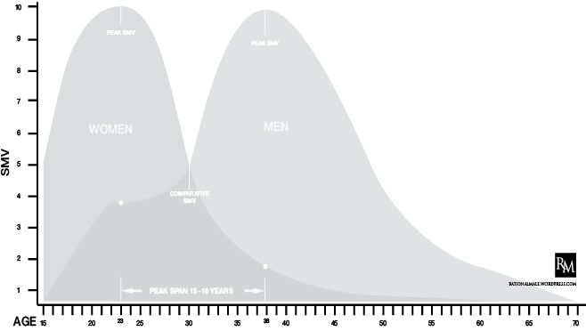

游戏

【谚】如果你需要一个提醒你如何达到一个特定的信念或一套信念，最好的方式来考虑（或重新考虑）的过程是写一本书。你现在手里拿着的这本书是我过去十二年参与所谓的 manosphere 的汇编。当时它甚至不被称为“庄园”。

对于自 SoSuave 论坛成立近 12 年来一直阅读我的观点的男性（和女性），我希望他们会发现这一部分是一种补救措施——就像回到他们已经内化并认为理所当然的古老经典。如果我提到超多情或女性命令，对于大多数人来说，对与这些和许多其他概念相关的元素有一个标准的预先理解。

然而，当我或任何熟悉红色药丸意识的人试图教育不熟悉的人时，就会出现熟悉的问题。红色药丸 reddit 社区对此做出了很好的努力，但在经历了本书的两次修订后，我和我的编辑都清楚地认识到，熟悉不熟悉的人是接触到那些从拔出（另一个 manosphere 术语）中受益最多的人的主要障碍。

熟悉

多年来，我收到的关于一本全面的理性男性意识形态的书的大部分请求都来自于读者，他们表达了希望以书的形式出版一本浓缩的
版本，可以送给家人和朋友（大部分是男性）希望他们能更好地理解从以 fem 为中心的思维模式中解放出来的需要。当然，从第一天开始，这一直是我的目标，但它假设大部分阅读内容都不熟悉我或熟悉的读者已经掌握的常用术语和概念。

我经常遇到的另一个问题是，假设我的博客的新读者或其他博客的
评论者对我的工作很熟悉。我经常发现自己不得不链接到我所涉及的特定主题的文章，而这些主题可能是评论家或好奇的读者想要带我去讨论的。在大多数情况下，我会有意识地努力避免重复我曾经说过的事情，有时是几年前的事情，但这只是博客媒介的一部分。

要想让男性从蓝色药丸的条件反射中解脱出来，这是一个非常困难的提议，但要让他们理解他们在心理上有抵触或厌恶的原则，这是一个特别的挑战。例如，我的编辑只对这些原则略知一二，这是一种幸灾乐祸。从某种意义上说，它需要我修改旧的帖子和概念，使之更加“友好”，但它也挑战我去回顾这些概念是如何演变成多年来我和其他“红柱子”现在认为共同的基础。例如，虽然我可能会在 Dalrock 的博客上与熟悉女性命令的人激烈地辩论这个概念，但在我的编辑阅读了我关于它的开创性文章后，我不得不花一个多小时与他进一步定义它。稍后将对此进行详细介绍。

游戏

在这些概念中，我最常提到的是游戏。“到底什么是游戏？”在我的博客中，以及几乎每一位主要的 manosphere 作家的博客中，都有一个不断的假设，即当提到游戏时，读者会确切地知道它是什么。游戏已经被提升到一种近乎神话的状态；就像普通男人在努力吸引女人的注意和亲密时的万应灵药一样。对 manosphere 博客来说，熟悉游戏已经成为轻率的话题——我们有各种各样的游戏：我们已经内化了游戏，我们有“自然”游戏、直接游戏、测试版游戏等，但对于那些不熟悉非常复杂的事物的人来说，定义“游戏”一词，对于新手来说，游戏建立的行为和基本心理原则在一开始就很难理解。

对于不熟悉的人来说，只有“游戏”一词似乎可以推断出欺骗或操纵。如果你在玩一个游戏，你就不是真实的，所以从一开始我们就从感知的
劣势开始。当试图向一个只习惯于和女人“做他自己”的男人解释游戏概念时，这一点就更加复杂了，而且据说女人讨厌和她们“玩游戏”的男人。虽然听起来很糟糕，但实际上是对游戏的解释，而不是促使新读者对游戏进行解释的普遍看法。

在根本层面上，游戏是基于
心理学和社会学原理对生活技能进行的一系列行为修改，以促进两性间的两性关系。

早期游戏

在其卑微的开端，游戏是一套行为，学习、改编和修改，其明确目的是改善一个男人与他只能接触到的（如果有的话）有限的女人的潜在性“成功”。游戏被定义为一系列行为技能和技术，这些技能和技术是由 2000 年代初兴起的皮卡艺术家（PUA）文化进行观察实验和开发的。虽然有一个外围的认知给予心理学，使这些行为集有效，目的是更多的结果，而不是头部力学，使结果成为可能。

这一介绍是当前 manosphere 与“正式”游戏的许多首次接触。《拾遗艺术》中的艺术的质量过去（现在仍然）取决于从业者理解行为心理学基础知识的能力（关于女性）在给定的环境和/或环境中，提高对目标不断变化的行为线索的适应和反应能力。。

如果这是游戏的唯一范围，可以理解，这是非常短视的，范围有限。在一开始，这个游戏的效用在于它帮助了大多数缺乏社交智慧的男性接近并与他们根本缺乏的女性建立真正的亲密关系。问题是，除了游戏中的“现场”使用，它还没有真正发展到“得到女孩”的地步，甚至让最善于社交的 PUAs 在更大程度上也没有准备好处理真正激励女性的心理。正是这种女性的元心理学驱使男人们，不习惯于享受，然后失去以前“与她们不配”的女人的感情，从而陷入抑郁，甚至可能自杀。

游戏是一套奇妙的技能工具，但如果没有洞察力和远见来处理这些工具所能构建的东西，它可能就像给孩子们炸药一样。

进化游戏

从最早的《盗梦空间》开始，游戏或多或少被视为一个问题的解决方案。游戏被描述为过去 60 多年的女权主义、社会女性化和女性至上为当今男性所创造的对女性的合乎逻辑的社会反应。由于现代的连通性、互联网和集体化的社交媒体，对男性来说，游戏或游戏的某些变化是不可避免的。尽管试图了解女性心理的男性受到公众的社会污名、嘲笑和赤裸裸的敌意，但私下里，互联网促进了一个全球男性联盟，该联盟比较经验、关联观察和测试理论。

促使女性产生期望反应的游戏的行为心理学开始对男性更为重要。当然，现在的经典游戏
技巧，如自大&滑稽、逗乐的掌握、同意&放大、负面点击、炫耀等，在他们自己巧妙运用的环境中是有效的，但使这些行为集起作用的潜在
心理引发了为什么的问题他们工作了。

有效（和无效）游戏的心理方面开始具有新的重要性。通过对影响游戏的生物学、心理学和社会学因素所起作用的更广泛探索，产生了新的想法、理论和实验性
模型，从而产生了新的游戏行为集，并抛弃了低效的行为集。

随着连通性的增长，游戏社区的知识库也随之增长。游戏不再是 PUA 先驱的专利；游戏正在扩展，以适应从未听说过早期版本游戏的男性的兴趣和影响，或者在几年前由于女性的制约而完全拒绝游戏的男性。

已婚男性想知道，游戏的某些方面是否会重新激发他们冷漠或专横的妻子的性兴趣。离婚的男人接受了他们在结婚时嘲笑的游戏，以提高他们对新的性兴趣的潜力，同时也讲述了他们的经历并为游戏知识库做出贡献。男性，不仅在西方文化中，而且从
全球化的兴趣开始觉醒，每一个新的贡献不仅是关于女性是怎样的，而且是关于为什么女性是怎样的。游戏让不可知的女人
变得可知。随着对游戏知识库的每一项新贡献，神秘的女性奥秘开始解开。

游戏变得越来越有趣。男人们现在看到了矩阵中的代码：我们知道媒介就是信息，我们开始看到控制我们的女性社会习俗，我们开始看到女性命令主义和中心主义的普遍影响，我们开始意识到阴险但自然主义，女性的多情对男性和女性都产生了影响。这个游戏促使男人们推开女性至上的铁幕，看看是什么让她这么做的。

可以预见，以 fem 为中心的社会试图将游戏的兴起和扩展塑造成 50-70 年代荒谬的男子汉原型的
现代版本。一种进化的、智力上更有效的游戏形式的威胁必须像任何其他男性游戏一样被嘲笑和羞辱，因此与臭名昭著的 PUA 先驱的联系显然是女性命令的选择。《第 22 条军规》
中的女性标准是第一条求助途径：任何想要学习游戏的男人都比不上一个想要学习游戏的男人，但也比不上一个还不了解游戏的男人（正如《女性命令》中批准的
。任何一个真正为这款游戏付费或亲自投资的人都与 PUA 文化有关，PUA 文化的特点是回归 70 年代的“休闲装拉里”。

当代游戏

尽管《女性使命》试图让游戏重新蒙羞，但它发现游戏运动并不像 20 世纪 90 年代中期那样容易被吓倒。当务之急是回到可靠的比喻和社会习俗上，这些比喻和习俗总是促使男性重新顺从。在 90 年代 fem 中心主义的顶峰，这些社会结构在孤立、羞耻和无知的男性命令上运行良好，但随着互联网的发展，到 2000 年代末，游戏正在滚雪球般地演变成一种威胁，需要新的女性操作惯例来遏制它。

游戏的发展超越了行为设定，也超越了强调女性心理和更大社会化的心理和社会学机制。虽然游戏仍然包含了所有先前的进化，但游戏开始意识到女性必须具备的更大的社会元尺度。游戏开始超越为什么女性是这样的问题，而进入拼凑如何我们今天
经历的跨性别文化适应就是这样的问题。游戏问我们是如何做到这一点的？

游戏在其范围内扩展到特定的兴趣领域，以回答这些更广泛的问题并解决更广泛的问题。虽然我们仍然拥有所有之前的游戏迭代，但我们已经扩展到基督教游戏、已婚游戏、离婚游戏、社交游戏、高中游戏等

然而，所有这些专业领域的基础仍然是在男人的生活中内化和个性化游戏的需要。游戏是男性重新赋权的途径；即使是今天的女性也仍然认为男性应该回到——直到现在。

游戏需要对男性气质进行重新解释，使之成为积极、有益和有能力的东西——完全不同于 60 年来女性化使男女信服的消极、可耻和可笑的原型。称之为阿尔法，称之为积极的阳刚之气，但游戏需要重新想象阳刚之气的重要性。游戏需要男人改变他们对自己的看法。

不用说，即使是在最积极的环境中，游戏所导致的男性重新赋权对女性来说也是一个巨大的威胁，女性的当务之急是不容许的。控制女性命令所建立的内在不安全感一直依赖于男性对其真正的个人价值和对女性的真正需要的无知。男人必须对女人保持必要性，以确保她们的不安全感得到保障，确保女性的控制。

游戏所代表的知识和意识之井必须中毒。

几十年来，女性义务所依赖的社会习俗不再像互联网时代之前那样有效。游戏不断扩展到社会、心理、进化和生物领域，这证明了游戏是那些旧习俗所不能包含的东西，因此《命令》在重新发明旧策略的同时，也进化出了新的策略。

羞耻和嘲笑是（现在仍然是）不那么聪明的女性必须采取的基本策略，但游戏的扩展性需要
更扭曲的东西。女性命令的支持者开始承认 某些游戏长期以来一直坚持的关于女性本质的普遍观点（而女性命令早就拒绝了），以期加入社会动力游戏，这一游戏花了十多年才发展起来。

女性命令无法与游戏原则的广泛、可证明的有效性相抗辩，因此它寻求从内部重新设计游戏，并根据自己的目的对其进行修改。女性迫切需要足够的男性权力来让男性回到一个更好的（实际上是更老的）有用的状态，以达到其自身的目的，但并不是说真正的男性从迫切需要中解放出来会威胁到其统治地位。在 co-中

选择游戏并承认它认为威胁较小的事实，祈使会希望建立更好的 Beta——男人们相信游戏赋予了他们权力，但仍然对女性祈使会心存感激。

真正从命令中解放出来会威胁到它的统治地位，因此有远见的人会被命令贴上黑暗、反社会和离经叛道的标签。仅仅为了游戏的利益而渗透游戏并对其进行净化是不够的，女性必须为游戏本身进行分类——邪恶与善良的游戏。好的，当然，无论是什么方面的特征都有利于命令，坏的，无论是什么
自私的，都有利于男性。女性主义不关心游戏的各个分支——自然的、内化的、婚姻的等等——它只关心这些分支的哪些方面可以被扭曲为它的优势，哪些方面不能。

这让我们进入了今天的游戏。游戏仍在发展中，如果我有
先见之明看到它下一步将走向何方，我敢说它将实现男性真正的
解放和女性的迫切需要。不是从女性身上解放出来，而是从她们的使命和目的中解放出来。这不是“男人走自己的路”忽视了女人，希望她们在别无选择后能像男人一样行事，而是 fem 中心主义长期以来所坚持的真正游戏驱动的从控制中解放出来。

别搞错了，女性的命令需要男人必须这样做，而且它总是敌视那些试图把其他男人从这种需要中解放出来的男人。在这方面，根据定义，任何游戏，甚至是命令将使用的增选游戏，都是性别歧视的。任何可能对男性有利的事情，即使是对女性有利的事情，都是性别歧视。从女性的定义来看，将男性从母体中解放出来，打破他们的局限性，鼓励他们重新想象自己和自己的个性，以改善自己，是一种性别歧视。

在女孩世界，鼓励男人成为更好的男人是性别歧视。

博弈论的演进

女人宁愿分享一个成功的男人，也不愿依恋一个忠实的失败者。

-扑通一声

在 SoSuave 论坛上，我被问到的最常见的问题之一是“你如何让婚姻保持新鲜？”我对此的回答通常是，与奥普拉标准答案的建议专栏相反，一段良好的关系应该是毫不费力的。所有这些“婚姻是一项持续的工作”都是胡说八道，目的是让丈夫保持一种持续的状态，以满足妻子长期保持亲密关系的需要。婚姻和 LTR 中的女性想要摆脱那种烦人的超亲和力竞争焦虑；他们想要安全感，不仅是经济上的，而且是情感上的，这种安全感来自于一种锁定的承诺，即知道自己是配偶/伴侣性亲密的唯一来源。

对承诺的预先承诺

女性在浪漫承诺后性频率下降的原因之一是，在承诺之前必须进行的性行为的紧迫性被该 LTR 中作为奖励/强化者的性行为所取代。在单身、未承诺、非排他性的生活中，性虽然非常享受，成为大多数女性的试验场。本质上，这是买之前的免费样品，它的紧迫性不仅是由（希望是）真正的吸引力和唤醒推动的，而且至少是由她在竞争性市场中的潜意识知识推动的。这是人生中为数不多的女性必须获得男性认可的时刻之一。诚然，大多数男人在早年的生活中都被剥夺了性生活，或者缺乏经验，所以对她来说，推销通常并不难。然而，在某种程度上的意识，即使销售几乎是有保证的，她也意识到她可以被一个更好的竞争对手取代。超多情驱使女性维持未来男性的兴趣。

这就是承诺性性互动的对比。现在的动态从资格性转向实用性。现在，在任何人下结论之前，是的，性仍然是令人愉快的，它仍然可以充满激情，她肯定会想要它，但动力发生了变化。性现在是一种工具。在她未承诺的性生活中，这是一种资格认证的工具；在她的 LTR 生活中，这是一个遵守的工具。这是非常明显的，根据女性的性格或某个特定问题对她有多重要，这可能或多或少是极端的，但毫无疑问，在这个星球上，没有一个女性在与她的 LTR/丈夫打交道时不考虑她的性代理。与她搭档的男人的性市场价值相比，这个机构可能或多或少有价值——取决于她的长相、举止、性能力等。

这就是关系基本规则的作用所在。这是竞争谁更依赖对方的持续相互作用。在过去的 50 多年中，妇女们共同努力，利用社会习俗，将自己的性取向确立为当权男人的终极目标。阴道=权威，而这正是太多男人向他人鹦鹉学舌并自我强化的东西。“改变，做吧，升华你的欲望，否则今晚就没有你的容身之处了，先生！”从表面上看，“保持和平”并完成她蜜月清单上的所有事情似乎是直觉，希望她能恢复你单身时的一小部分欲望，因为她迫不及待地想回家和你上床，所以她没有孩子，约会后在车里搞砸了。

上风

LTR 先生们，我在这里告诉你们，是的，如果你们无所畏惧并愿意行使你们的权力，你们在这方面确实有着内在的优势。我在最后一段中描述的只是男性演绎式的问题解决方法，我们在生活中使用了很多其他的东西。这是最直观的解决方案——照她说的做=做爱。

因此，答案违反直觉并不令人震惊。你必须找到办法，巧妙地回到她一开始对竞争的焦虑状态。我微妙地强调，因为，与大多数其他女性一样，公开这样做会遭到敌意、怨恨，充其量是义务服从。

为了获得更多（任何？）性，为了保持身材，为了激发她更多的尊重，你必须脱离她。这并不意味着变得傲慢冷淡，或者像孩子一样闷闷不乐，或者马上变成一个混蛋；这些是显性符号和方法。我们需要的是逐渐重申自己是主要的，她的性代理虽然仍然受到欢迎，但并不是你自己决定的动力。

我喜欢说，没有阴道值得多年的遗憾，但这正是大多数男人发现自己的地方，因为他们要么不愿意，要么无法撼动阴道之舟。他们不明白女人的想象力是唐璜工具箱中最强大的工具。

刺激想象力的演绎和明显方式是脱口而出并说：“看，婊子，你的阴部不是金子做的，如果你不挺直腰板，还有很多其他女孩准备擦亮我的鼻孔，明白吗？”这当然会遭到她
的抵制或羞辱。更好的服务于男人的是对自己进行渐进式的改变，让她觉得自己对其他女人有吸引力。

女人想和其他女人想做爱的男人在一起，而其他男人想成为。

这是双向的。他变得越有能力，他获得的体形就越好，他获得的职业成就就越多，他获得的社会证明和地位就越多，他使自己变得越有价值，产生的焦虑就越多——而这正是女人后脑无法反驳的熟悉的竞争焦虑。

我告诉陷入“她身材”关系的男人们的第一件事就是去健身房，努力训练，看起来更好。这有两个影响；首先，这让她对做爱的兴趣增加，其次，这激发了她的想象力。

“他为什么这么做？他最近看起来真的好多了，我看到了，其他女人也一定看到了。也许我需要开始锻炼了？天哪，健身房里的那些女孩看起来真不错。”

她无法与健康的愿望抗争，那就是看起来更好，感觉更好，关心你的健康。保持良好的状态是最简单、最直接的改变。你在工作中获得晋升的影响力可能很小，但你现在可以改变你的身体习惯。女人，作为一个精打细算的性别，在分手前几个月都很清楚去健身房锻炼——她不是在为你塑形，她正准备和下一个她要做爱的男人一起跑步。他们知道这一点，所以你表现出同样的行为“给仓鼠加咖啡因”，因为它会让他们回家。

阴道不是权威

不要接受她的性取向是关系的权威。你做得越好，你掌握的权力就越多，你向她让位的越多，你掌握的权力（和尊重）就越少。

女人需要被告知“不”，事实上她们希望你告诉她们“不”，特别是考虑到房间里有一只 800 磅重的大猩猩——她的性中介。当一个女人用她的阴道控制 LTR 框架时，它总是会影响你与她的交往。这不是人生的路。它变成了一种永远存在的、不说出口的理解，即她最终可以玩阴部牌，而你会遵守。

虽然这可能会让她在短期内感到满意，但从长远来看，你会失去她的尊重。她希望别人告诉她“不”，尽管你知道她会坚持你。这是对她的性代理的最终否定——“如果他说“不”，并预感自己不会得到任何性代理，那么我的性能力就会贬值。”如果她的性代理受到质疑，就会留下怀疑的空间，并再次打开竞争焦虑的大门。

正如我之前所说的，婚姻并不是对性市场的隔离，没有人比女性更了解这一点，她们可以依靠一个社会来奖励她们认识到这一点。现在将其用于您的福利。

对于女人来说，没有什么比她怀疑的一个自我意识到自己价值的男人更能同时激发和激发恐惧了。

这就是为什么女性化的文化必须不断地迷惑他，不断地激发怀疑和羞辱他；女性化不能让男人知道自己的真正价值和潜力。

最后，如果你一个星期都没有上床，谁会在乎呢？作为一种商品，作为一种权威，她对你的尊重与日俱增，这是值得的。如果你想保持这种焦虑，你必须使自己永远成为女人们将要竞争的商品，甚至（特别是）在承诺的一夫一妻制的范围内。

改写规则

你知道，图形、图表和数据绘图真的是无可替代的。人类本质上是一个以视觉为导向的物种，看到的是一个图形化的平视显示器，一个上帝的视角，就像看到森林看到树木一样重要。你可能不喜欢在家里做预算，但给一个人看一张他一个月内所有钱都花在哪里的图表，他会觉得在几个周末的时间里，他不会因为在脸颊上啄一啄而把钱浪费掉。

正是考虑到这一点，我决定自己绘制一份关于我们目前所经历的鲜为人知且远未得到充分重视的性市场（SMP）的年表（至少自性革命以来）。manosphere 的博主们经常在一个假定读者已经熟悉他们的思维模式并理解现代 SMP 动态的环境中使用 SMP。我个人认为这个假设充满了个人偏见，无论是有意的还是无意的。毫无疑问，我将从我自己的观点来定义 SMP 和性市场价值（SMV），但我完全认识到需要以清晰、可理解的形式来定义这些动态，因此我恳请读者原谅我的放纵。

我能毕业吗？

在撰写本文时，许多高中高年级学生都快毕业了，随之而来的是“成年人”们的大量高谈阔论，他们想向下一代传授一些宏大的智慧之词，因为他们一头扎进了未来的学生债务和/或暗淡的就业前景。对于父母和无子女的成年人来说，这是一个特殊的时刻，他们可以反思自己的生活，并扪心自问：“我会告诉年轻的自己做什么不同的事情？”与希望相反的是，这个 18 岁的年轻人觉得自己不得不扮演年轻人的角色，他们会放弃给朋友发短信，告诉他们谁会给谁买他们的舞会夜酒，时间足够长，让他们沉醉其中。所以你必须原谅我在这里扮演教授，而我也在做同样徒劳的尝试。

不久前，我有一位评论员告诉我，。。

“罗洛，我只是想说你的作品对我来说真的是一个突破。这本书应该是所有高中毕业生的毕业要求。”

好吧，退休教授罗洛·J·托马西博士在教育下一代了解性市场的危险这一神圣职责上如此失职，否则他们会盲目地蹒跚而行。接受挑战。

所以请大家围在讲台上，关掉所有手机（舞会夜酒很容易买到），从你的 Pee-Chie 文件夹中拿出一张笔记本纸，准备在……上做笔记，。。

导航 SMP

现在，同学们，如果你们注意上面的显示，我将解释这个图表的参数。

在垂直栏中，我们有基于普遍存在的十个量表的性市场价值（SMV）。Heartiste 城堡的退休教授 Roissy 为我们提供了很好的服务，他在很久以前就为男性和女性详细阐述了个性化的性市场估值，然而，就我们今天的目的而言，重要的是要注意，我在这里说明的估值是指包括基于长期和短期繁殖前景、关系期望、男性供给能力、女性生育能力、性期望和可用性等的总体性价值。。您的里程数可能会有所不同，但可以这样说，十分制旨在反映其他对某一性别的个性化总体价值。异常值将始终是任何研究的一个要素，但其目的是在此处表示一般平均值。

在水平度量中，我们有一条基于性别年龄的时间线。我已经将其分解为五年递增的阶段，但每个性别的显著年龄代表了重要的生命到评估阶段，将在我们的讲座后面详细介绍。

作为旁白，你可能会注意到我在 15 岁时就开始了 SMV 的年龄范围。这是有意为之的，因为这是由同年龄的普通高中男生评估的普通女生中等期望值的基线起点。同样值得注意的是 23 至 36 岁之间的年龄范围，这代表了男女之间的最高跨度年数，也将在后面详述。

最后，我描绘了每个性别各自的 SMV 范围钟形曲线，并相应地指出了它们的交叉阶段。

女子 SMV

在各种情况下，女性 SMV 无疑是男权领域讨论最多的话题。不管我们怎么努力，说服一个女人她的性高峰实际上在 18 岁到 25 岁之间，这始终是一种反驳否认的努力。尽管所有自我说服的
试图重新定义性价值，但女性的 SMV 最终是
由男性而不是女性决定的。因此，这条钟形曲线旨在代表基于男性指标的女性性价值，而不是女性（通过不断的社会
工程）想要定义欲望。

随着我们的继续，你可以看到，女性 SMV 的最高年龄约为 23 岁。生育能力、欲望、性可用性以及男性唤起和注意的整体潜力在 22 至 24 岁之间达到顶峰。记住，这个近似值不是对个人价值、忠诚、才智、性格的估计，也不是对男性欲望基线之外的任何指标的估计。女士们，平均来说，这是你们最好的一年。我不认为我在叙述任何事情。你后脑的冷酷的事实并没有在晚上唤醒你。

在女性生命中的任何其他阶段，她都不会比这短暂的一段时间更享受肯定或合法的男性关注，更热切地申请她的性认可。一旦超过顶点，她花在产生男性唤醒线索上的每一次努力都将试图重新获得这一阶段的经验。每一个后顶点，前壁（24 至 30）卡路里的女性燃烧将由她的 SMV 峰值的记忆驱动。

到 27 岁时，女性 SMV 的下降已经开始。这并不是说
女性在高峰后的岁月里无法保持惊人的魅力和活力，但与下一批 22-23 岁的年轻人相比，这种下降越来越明显。随着时间的推移，寻找超级合适配偶的竞争越来越激烈。27 岁至 30 岁的女性在潜意识中压力最大，因为她们意识到必须用“派对年”的短期
交配协议来换取长期供应策略。

正是在这一点上，“过新生活”或“正确对待自己”的合理化开始形成；不是因为内疚或定罪本身，而是为了缓解与新现实相关的焦虑，即她最终将无法在 SMP 中有效竞争。写在墙上；要么她必须建立自己的安全和供应，要么满足于作为一个可接受的供应商，因为她目前的外观，个人愿望和性代理将允许确保一个男人的长期供应。

男性

从 15 岁开始，男孩 SMV 的起点如此之低，这似乎令人沮丧地悲观，但请记住，我们看到的是总体平均水平。一个 15 岁的女孩会认为一个 18-20 岁的男人的性认同比她同龄人的性认同更有价值。这并不是说著名男孩的关注毫无价值，但对于一个十几岁的女孩来说，这些关注要平凡得多，因此评价要低得多。

随着男性年龄的增长，你可以看到他们的 SMV 在 20 多岁时趋于平稳，直到 30 岁时逐渐上升。这代表了男性的慢身材 SMV，因为他们的身体实力、社会引力、地位、成熟度、富裕程度、影响力，以及（希望还有）统治地位都变得更有价值。这是一个缓慢的过程，不幸的是，男性的 SMV 显著成熟，大部分发生在女性达到自己的 SMV 峰值时。在 23 岁的时候，当一个女孩正在享受她最好的 SMP 值时，一个男人才刚刚开始自己的逐步提升。

到 36 岁时，普通男性已经达到了自己的相对 SMV 顶点。正是在这个阶段，他的性/社会/职业吸引力已经成熟。假设他最大限度地发挥了自己的潜力，在这个阶段，女性的超情欲指令将发现他是她长期投资最可接受的。他足够年轻，可以更好地保持体格，但足够大，已经达到社交和职业成熟。

SMV 与高峰跨度年比较

这里一个重要的注意事项是比较男性和女性的 SMV 下降。女性的 SMV 主要基于身体，其下降幅度比男性要大得多。世卫组织的衰落取决于维持其地位和健康/容貌的能力的下降。由于一个人的 SMV 主要来源于他的个人成就，因此他的 SMV 退化具有更大的保存潜力。女性的 SMV 灼热而短促，而男性的则缓慢而漫长。

现在，同学们，请注意
女性 SMV 峰值和男性 SMV 峰值之间 15-16 年的关键跨度。毫不奇怪，这段时间通常是两性之间社会最混乱的时期。大多数初婚发生在这里，单身母亲发生在这里，高级学位，职业生涯，撞墙，以及许多其他重要的生活事件都发生在这个人生阶段。因此，我们有着深刻的重要性来理解 SMV 的背景，以及 SMP 在这一时期对男女经验的影响。

在 30 岁时，男性刚刚开始表现出对其固有性价值的某种原始意识，而与此同时，女性正痛苦地意识到自己明显无法与性竞争对手无限期竞争。这就是
比较性 SMV 的要点：当两性处于大致相同的估值水平时（5）。这方面的矛盾在于，男性刚刚开始意识到自己的潜力，而女性则必须与自身的衰退作斗争。

这是女性必须兑现其生物芯片的初级阶段，希望他们可以投资超多倍体的最优秀的男性不会意识到他们天生的 SMV 潜力，以至于他们会在高峰阶段选择一个年轻女性（22-24 岁）而不是她。我稍后会在威胁中写到这一点

对于女人来说，没有什么比意识到自己对女人的价值的男人更具威胁性，同时也更具吸引力了。

两性相对 SMV 的融合可能是女性多情生活中最关键的阶段。她必须能够让他对自己的 SMV
潜力一无所知足够长的时间，以优化她的超配偶。女性社会的整体

影响围绕着优化这种超多情状态，只要她有足够的欲望去实现它。

就男性而言，在他做出改变生活的决定之前，他必须意识到自己的 SMV（或其潜力），因为他不了解自己的潜力，并远离女性多元化的性策略，根据自己的最佳利益做出这些生活决定。

我所认识的每一个男人，如果他告诉我他多么希望在结婚前知道
manosphere 或者读过我的文章，或者“意外”撞倒了他的女朋友，他都会后悔在她（在法律上和情感上）巩固了自己的性需求之前没有建立这种 SMV 意识联系。他们往往更看重女性，而不是她们自己的个人潜力，以便在后来实现 SMV 峰值——或者他们从未意识到这一峰值，因为他们没有意识到这一点。

好吧，恐怕今天的课就剩这么多了。我希望这个简短的强化课程能给你一些思考的食物，因为你进入了一个女性化的世界，这个世界在法律上和社会上都致力于优化超亲。请记住，当你看到你的
杰出的 manosphere 讲师穿着我们的教授帽和长袍从画廊自豪地凝视时，一盎司的预防抵得上一磅的治疗。

下课。我们就是我们所说的自己。

我们就是我们所说的自己。

每天化妆的女人是“做自己”吗？

那个植入物的女人怎么样，她是“做自己”吗？那穿高跟鞋的女人呢，因为高跟鞋能使她的身高增加 4 英寸？除了 FaceBook 上的派对照片，你看到的那个女孩就是她自己吗？

让我们换一种说法，如果一个女人穿着一套强调肩膀的西装，夹克里有垫子，那么她是如何“做自己”的呢？如果她染发，会不会让她变得不那么真诚？

如果做我们自己是一种理想状态，那么我应该有理由期待一位志同道合的健身模特会被我吸引，即使我最大的热情是坐在沙发上，吃一个大比萨饼，然后在看周一晚上的足球比赛时用 6 包米其洛布把它冲下来，对吗？毕竟，我只是做我自己——这就是我自己。

相信，你将成为

外行与 JBY（做你自己）动力最难的区别在于个性是可塑的。个性总是在变化。今天的你不是两年前的你，也不是两年后的你。有些特质和特征我们可能会终生携带，但即使是这些特质和特征也会随着环境的变化而变化。你定义了什么是你自己在任何给定的时刻，它是相对于你的个人条件和环境。

那么你的底线在哪里？什么时候真正的性格改变才是合法的，而不是“肤浅”或“肤浅”或“你不是什么人？”这些只是几个世纪以来女性（和太多的傻瓜）成功使用的流行术语，而男性已经内化为女性认为不受欢迎的感知状态，但他们从未准确定义。相反，他们故意保持模棱两可，通常是相对于女性个体的解释，而他们的行为
表明了他们自己的动机。

你就是你所相信的你，你就是她所认为的你。

对任何人来说，无论男女，最难听到的事情之一就是他们需要改变自己的生活方式。这意味着他们只是“做自己”在某种程度上是他们目前状况的错。这类似于告诉某人他们的生活
不“正确”，或者他们抚养孩子的方式不对。

如果我有一个朋友正在注射海洛因，我积极鼓励他停下来，努力帮助他“清理”，社会会称我为英雄或救世主。当我鼓励我的朋友在她患癌症之前戒烟时，我是一个关心的好朋友，帮助我的朋友进行危害健康的行为。但当我告诉一个朋友，他需要改变对女人的态度，这是他不快乐的原因，他需要改变对女人的看法和态度，让自己看起来更好，感觉更好，那么我就是一个“肤浅”的刺客，对他的“问题”麻木不仁。更糟糕的是，甚至试图以尽可能积极的态度提出建设性的批评，认为一个人可以通过改变自己的观点和行为来改善自己。

个性不仅具有可塑性，而且在特定
条件下会发生巨大变化。

一个简单的例子是患有创伤后应激障碍的退伍军人。这些人暴露在创伤环境中，从根本上改变了他们的性格。虽然这是一个极端的例子，但它表明成为一个“不同的人”是一个条件问题。如果我的情况是这样的，我喜欢坐在家里吃一整片披萨，喝六包百威啤酒，在周五
晚上看动画片，那么我真的能指望健身房的热辣健身教练过来，真的想把我的脑袋搞砸吗？

为什么不呢？毕竟我只是做我自己，她应该“因为我是谁而爱我”，对吗？如果这是我的情况，定义我个性的条件与吸引和/或维持与条件不是我自己的人的关系是不一致的。

JBY 是一种有效的社会习俗，有助于多妻。

女性非常乐意支持和支持 JBY，因为她有意识地认为这“听起来是正确的话”。

这是一个无懈可击的位置；谁不想让你成为你自己？如果一切都取决于内在因素，那么任何告诉你改变 must 的人都是出于自私的原因操纵你。当墙的影响开始显现在她们的体格上，她们希望被爱是因为“她们是谁”，而不是因为她们过去的样子，这很好地契合了大多数女性会求助于流行的肥胖接受自我接受咒语。

然而，在潜意识层面上，培养男性 JBY 社交
惯例的潜在目的是另一种性别选择过滤机制。事实上，这更像是一种过滤故障保险，因为通过在社会上强制要求普通男性的真实性，女性在对男性的性评估的准确性方面更加安全。如果所有的男人都是只是做自己并且被鼓励成为他们“真正的自己”，那么这将有助于女人确定哪个男人最能满足她的超配偶。

正如我在之前的许多帖子中所说，女性声称希望男人诚实，但没有一个女性希望完全公开。从一般意义上说，我建议这样做是因为它能保持男人的神秘气息，只有在对男人有着
适当的兴趣和反应的女人才能逐渐发现。然而，故意保持模棱两可的另一个原因是为了消除女性认为男人默认心理的 JBY 动态。

维持女性命令作为社会命令的一个组成部分
包括保持女性作为主要的性选择者。这意味着
女性的性策略要求她处于最佳状态，因为她的
能力（吸引力）允许她从可用的最佳男性中选择满足该策略的男性。

JBY 是维持女性命令作为社会命令的工具。此外，JBY 在优化超多情方面发挥作用，帮助女性在评估哪个男人最适合她的超多情时产生安全感。具有讽刺意味的是，一旦一夫一妻制的关系建立起来，女人对在这种关系中“固定”她的伴侣感到焦虑，JBY 的动力就被颠覆了。曾经只是他自己的伪真实被“我在为他工作”所取代，以使他成为理想的男人，得到她的超亲和力的认可——从而暴露出杰比真正要开始的精心设计的胡说八道。

我们就是我们所说的自己

我们可以改变自己的个性，并根据我们的条件或两者的任何组合来改变它们，但认为个性是静态的是错误的。 

陷阱在于认为改变个性无论如何都是不诚实的——确实有
非常棒的“演员”或“装腔作势者”，等等，当我们面对他们时，我们感觉（甚至知道）他们正在推一个他们可能不完全舒服的信封，但“在你成功之前假装成功”的原则是有好处的。

只有当我们对之前的一系列人格行为有了概念或知识时，我们才会将其视为“虚假”、“肤浅”或“试图成为你所不具备的东西”。如果你这个周末在一家俱乐部遇到了一个可爱、自大、有趣的家伙，如果你以前从未见过他，你怎么知道他是真的，还是在扩展他的个性呢？

来自 48 条权力法则

法则 25：重塑自我

不要接受社会强加给你的角色。通过打造一个新的身份来重塑你自己，一个吸引注意力、永不让观众厌烦的身份。做自己形象的主人，而不是让别人为你定义自己的形象。在你的公共手势和动作中加入戏剧性的装置——你的力量将得到增强，你的角色将看起来比生活更伟大。

我知道，我知道，好人 vs 混蛋已经被打了很多次了。

我认为游戏仇恨最容易的目标之一是术语。将主观定义应用于“好人”或“混蛋”等原型太容易了。标准二进制响应通常为

“所以，我一直都是个十足的混蛋，否则女孩们就不会被我吸引？去他妈的，我不喜欢玩游戏。”

你可以浏览我提供的任何数量的论坛页面，一遍又一遍地阅读我告诉年轻人“接触他们内心的混蛋”。

然而，在我的任何帖子中，我从来没有声明过自己实际上是个混蛋。

我被问到的两个最常见的问题是“为什么女孩如此喜欢混蛋？”和“我如何走出朋友圈？”这句话。这两个例子都说明了光谱的不同端点。

试着这样想——在这一系列的一端，你有一个完美的混蛋，他令人讨厌，是个混蛋，近乎虐待，但女人成群结队地向他涌来。
在天平的另一端，我们有一个非常好的男人，他做并体现了任何女孩告诉他为了实现
亲密关系他需要成为的一切，并将这种门垫条件内化为自己的个性。这个男人会花无数的时间在电话上和一个女孩做朋友，或者花很多钱给她买礼物来获得她的认可。

我认为重要的是要了解“混蛋”和“好人”这两个词的词根。不要忘记这些特征的存在，因为女性根据自己的共同评价给他们起了这些名字和分类。女人定义了这些术语——男人只是简单地与它们联系在一起。我们现在倾向于将这些视为模仿或漫画；
虐待妻子殴打混蛋或擦门垫的好人。这是
光谱的两个极端，在经过坦率的评估后考虑它们时，错误变成了二元全有或全无解释。

“所以我更像一个混蛋，……好吧，我不是那样的。”AFC 说，对女性的言行表里不一感到沮丧，但这没有抓住重点。

问题是，如果你想到那个混蛋和好人之间的一个中心点
光谱，大多数人倾向于好人（如果不是一半的话）。这是绝大多数男性默认的“接触女性的一面，相信女性的言行”。这是女性所习惯的，因为它是如此普遍，而女性之所以鼓励它，是因为它最适合她们的性别。真正的极端混蛋和真正的极端好人一样罕见，所以在这方面，有必要按照程度来看待事情。

大多数男性都是贝塔族，或者说绝大多数男性都将自己投入到贝塔族男性身份中。他们选择了这一系列中友善、随和、恳求的一面——对于大多数人来说，他们已经在社会上习惯于抑制任何自然的男性冲动，以适应和认同女性的迫切需要（或者至少是他们被引导理解为她们的迫切需要），冒着被亲密拒绝的风险。正是这种心态，85%的男性订阅的测试版男性默认为“好”端，这使得倾向于“混蛋”端的男性更具吸引力。

是的，自信和冷漠是阿尔法特征，但在一个充斥着好男人准备给性感女孩买饮料的世界里，她认为是“一点都不在乎”的男人具有性潜力。正是在过去 50 多年的时间里，这种条件作用使得光谱中美好的一面成为默认。这并不意味着所有的好人都是可怜的同情者，没有脊梁骨，卑躬屈膝地站在他们碰巧依附的人的脚下。也就是说，相比之下，因为“变好”的压倒性倾向是标准，所以即使稍微倾向于性格急躁的一方的人，也至少会变得引人注目，最多也会变得有吸引力，这仅仅是因为他与一群好男人分离了。

他在两个层面上都很有吸引力，第一个是基本的阿尔法生物学层面，对于一个果断、有控制力、自信、不太关心
女人的男人来说，因为他意识到（在某种程度上）他的商品价值来自于
拥有这种态度的选择。

第二个原因是，那个靠挺举的家伙是一头紫色的奶牛，生活在一片平淡、无色、漂亮的奶牛场里。他引人注目，这也使他成为一个值得与女性竞争的男性，这也增强了他有选择的意识。他不是一个施虐者，他本身也不是一个操纵者，但他倾向于把自己放在被他吸引的女人之前或之上（有时天真，有时冷酷）。

讽刺的是，AFC 认为情况正好相反。他认为好人是一群混蛋中的异类。当然，他相信这一点，因为这是他所有女性朋友谈论的话题——她们的“混蛋 BFs”，以及她们作为好听众是多么的好。因此，他的自我形象得到了验证，他相信自己是独一无二的，因为“不像其他男人”，他的耐心和敏感性最终会得到回报——一旦他痴迷的对象与坏男孩一起玩得开心（可能还会长大），这很可能会得到回报。

新的世界冲动指令。

对游戏的另一个批评是，人们担心名义上的好人会牢记这一教训，成为一股新的社会潮流，成为令人无法容忍的混蛋。恐惧是新一代傲慢的刺客为了勾搭而“不做自己”。我理解，在 PUA 或 MRA（男性权利活动家）社区的推动下，人们担心大量男性会将自己的个性极端化。

让我首先说，这些担心是没有根据的。男人们不会搜索
社区、博客或论坛，因为他们因为
原型“好”而变得太性感了。事实上，我们可以说，更多的“以自我为中心”的男性似乎最容易发生性行为，这一现象非常普遍，以至于在主要社交网站上有一整节专门讨论这一问题。这让我相信，突然向冲动的范式转变并不是任何人都应该害怕的威胁。从定义上讲，好人很难有效地扮演一个混蛋，更不用说真正地将他们的个性转变为一个混蛋了。

大多数男性都会 d 更倾向于向频谱的颠簸端靠近，如果有的话，并且假设他们开始相信事情不像以前相信的那样。贝塔男性更常见的心态是期望女性应该欣赏自己是一个“好的”、可靠的、自我牺牲的男人，这是自他母亲以来所有女性都告诉他的。

相信世界应该为你而改变要比接受你需要提高自己才能得到你想要的东西这一事实容易得多。这是一个懒惰的人取消资格或贬低他迫切想要的东西，但缺乏动力改变自己去得到。所以，他以前想要的那个性感的“优质”女孩，在被拒绝后，就变成了“垃圾俱乐部荡妇”。真正有品质的女孩应该无条件地爱/渴望他，“因为他是谁”，而不是强迫他提高自己，这意味着他应该成为他被教育憎恨的漫画式的混蛋原型。大多数人都拒绝成为他们所讨厌的人，即使这是一种向好的方面的改变。

首先，我们不应该担心把好人变成混蛋的社会影响，而应该让他们有自我意识。在这样的努力中造成真正的冲动的风险是一种体面的权衡。

期末考试-导航

性市场

做你自己

好人-混蛋光谱

在我开始讨论这个问题之前，让我以我解释它们的方式来定义一些术语。随着 manosphere 和一些著名博客的流行，在描述现代文化中男性的某些分类时，使用阿尔法和贝塔（有时是欧米茄）这两个术语有了新的进展。

请允许我记录在案，将这些想法视为思维定势，而 AFC 或 Alpha 等术语则是真正的存在状态。例如，一个有背景的阿尔法可以是他的专业领域的主人，但在女性方面仍然是 AFC。一个贝塔男性在地位上仍然可以像他的条件和财富所赋予的那样富有和精明（通常是由环境决定的）。

有些州需要某些心态——积极的男性化状态需要阿尔法心态——其他州则不需要。此外，不要错误地将成功（个人和职业）与阿尔法心态联系起来。在 hotchickswithdouchebags.com 上有很多 alpha，但是这并不一定使他们成为全面发展的个体。我倾向于将观念α和β视为潜意识状态或态度，它们在我们的思想、信仰和行动中表现出来。

测试版游戏

考虑到这一点，我想提出 Beta 游戏的想法。因为我们在这里使用的是 Alpha 和 Beta 术语，所以掌握它的来源是很重要的。任何对动物社会等级有粗略了解的人都知道社会集体中阿尔法和贝塔个体的原理。阿尔法人往往是表现出最佳遗传特征和行为技能的男性，这些特征和技能使他们处于潜在繁殖群的顶端。事实上，beta 在科学研究中很少被提及；有阿尔法，还有其他的组合或集体。贝塔一词，用 PUA 行话来说，确实有些新奇。将这些术语与人类社会互动联系起来，虽然有时是主观的延伸，但理解基本的代表性概念并不难。我们可以看到它们的相似性，以及在野外长期和短期繁殖方法中的应用，它们反映了我们自己的情况。

与任何其他贝塔动物一样，必须开发替代方法，以促进人类在严酷的阿尔法竞争条件下的繁殖。本质上，正如在野外发现的那样，贝塔雄性已经发展（进化）出了一些方法，试图从阿尔法的后宫“偷猎”潜在的雌性，或者至少在这种情况下，从他感知到的潜在后宫。

标识

Beta 男性游戏主要关注 Beta 识别和同化自己，使自己更像她们希望联系的女性，但它超越了这一点。

该方法规定，贝塔被认为是唯一的（或至少是分开的），不同于他所期望的女性自然喜欢的更“普通”的阿尔法男性。这是他希望在理想化的女人身上唤起的“不像其他男人”心理图式的开始。

由于他无法在体能上与一流选手竞争，他必须以自己的方式进行一场艰苦的心理战。这包括说服他的目标，她最好的父母投资应该与他在一起（根据她声明的要求），因为他更紧密地体现了她的长期先决条件。贝塔人将自己比作她，并根据女性的要求塑造自己，努力最大限度地与她和女性保持兼容和熟悉。

这种认同过程通过他所认同的女性社会习俗得到了进一步加强。女性社会（包括男男女女）间接奖励他更接近其理想——更像一个原型女性；敏感、移情、情绪化、寻求安全感等。。不仅如此，当面对任何与女性积极观点相反的事情时，事实上也会冒犯女性。提升女性，让她们变得更少，让她们变得更多，作为回报，她更倾向于和贝塔交配。

这是原则，不一定是现实。从某种意义上说，这是一种船长拯救一种宏大的心态。当然，这其中的谬论是假设“同类应该吸引同类”。贝塔男性无法理解异性相吸，除非有明显的例外，大多数女性都不想与其他女性结婚，尤其是不想与自己结婚。

不合格

当面对地位优越的竞争对手时，两性天生的、潜意识的
反应是以尽可能方便的
方法取消该竞争对手的繁殖资格。对于动物来说，这通常包括某种求爱行为或完全的竞争性敌意。虽然人类也是如此，但我们天生的社会冲动要求我们更加机智。 

“看看那个女孩，她一定是个荡妇，穿上/表现得像那样”，或者“是的，他长得很好看，但那样的男人通常都是同性恋”就是人们用来取消各自性别资格的标准社交武器的一个例子。在最基本的水平上取消竞争对手的资格——质疑他们的性取向。从字面上说，质疑竞争对手是否适合与潜在配偶交配。

虽然大多数男性（阿尔法或贝塔）都会做出类似的尝试来取消参赛资格，但贝塔的方法与他在取消参赛资格时对女性身份的需求有关。从本质上说，他依靠女性的方式来取消资格，他利用自己与他希望模仿的女性的相似性——因此，他认为，通过一个机会来证明自己与女性的认同度，从而进一步增强了潜在的吸引力。参赛者可能不是同性恋，但由于他的
参赛者无法（或能力减弱）像他一样识别和同情他想要的女性，因此他必须被视为不如测试者。

对于阿尔法竞争对手，女性的社会习俗已经为他开辟了这片土地，他所需要做的就是播种。事实上，阿尔法倾向于体现他所拥抱的男性的反面，这也助长了这种冲动。他的信念是，女人不会被有男子气概的硬汉所吸引，她们想要的是一个善良体贴的男人；一个好的倾听者。因此，自然的办法是扩大这种差距——“阿尔法是 1950 年代尼安德特人的倒退，他很“痛苦”，他是一个厌女主义者，他是一个男人身体里的孩子，脆弱的自我只对做爱的女人感兴趣，然后继续前进。”他和女人集体中的任何东西都不一样，合格男员工的先决条件列表。他必须被嘲笑——就像所有女人嘲笑的那样——因为他自私、公开、过度阳刚之气。

此外，贝塔人需要让阿尔法看起来很普通，同时让自己看起来很独特。为了有效地取消阿尔法的资格，贝塔必须表现出他对女性的
同情，她必须欣赏否则一切都是徒劳的（通常是这样）。这不仅是一种自我保护机制，而且被视为实现他所渴望的性回报/欣赏的工具。

解释

所有这些实际上只是触及了 Beat 游戏演变的表面。我要补充的是，所有这些方法都有一个共同的根源；在竞争的压力下繁殖的需要。我在这里讨论的大部分内容，主要是女性身份的联想，在一生中都变成了自我投资和内化。在相对匿名（如互联网）的支持下，贝塔仍然会坚持他的心理模型，即使面对与他的游戏有效性相矛盾的非常理性的经验证据，原因无非是一个女人，一个他可以识别的潜在伴侣，可能会读到他的帖子，可能会被他吸引。即使证明了他的错误，他也不会放弃比赛。

测试版游戏就像男孩在开始男孩对女孩踢球时决定加入女孩队一样。他认为这会使他自己受到他们的喜爱，而实际上这只会让他成为另一个可以一起傻笑的女朋友。

每个人在某些方面都有自己的游戏。这种游戏的有效性可能或多或少是有效的，但在某一点上，一个男人会根据他的条件和环境来适应诱惑的方法。即使是普亚斯大师也需要根据不同的环境——不同的俱乐部、不同的女性类型、不同的社会经济水平、不同的国家等——调整他们的游戏，需要进行调整和即兴创作。

Beta 也是如此，但不同之处在于 Beta 倾向于采用一刀切的方法。尽管有人抱怨担心游戏社区会变成脚本化的“社交机器人”，但实际上是 Beta 版采用了更为嵌入式的脚本，并且不太可能从中变异。Beta 倾向于坚持对他们有用的东西，过去为他们强化的东西。

测试版游戏

在任何重大约会之前你都会把鸡噎死，不是吗？

看过电影的人都非常熟悉现在经典的“发胶”事件。

Dom:在任何重大约会前你都会把鸡噎死，是吗？告诉我你在任何重大约会前都会打猴子。哦，天哪，他在重大约会前不会鞭打海豚。你疯了吗？那就像拿着一把装满子弹的枪出去！当然这就是你紧张的原因。哦，我亲爱的朋友，请坐。听着，嗯，在你和他发生性关系之后一个女孩，你和她躺在床上，你紧张吗？不，你不紧张，为什么？”

特德：因为我累了……

Dom:错！这是因为你的脑子里再也没有婴儿面糊了！天哪，那些东西会把你搞得头晕目眩的！看，男人一生中最诚实的时刻是他发疯后的几分钟——现在这是一个医学事实。原因是你不再试图做爱，你实际上……你是像女孩一样思考，女孩喜欢这样。”

即使你从未看过这部电影，你也可能至少对 Dom 在这里解释的 Beta 游戏原则有所了解。你能找出不一致的地方吗？

。。你像个女孩一样思考，女孩们喜欢这样。

不，他们没有。对不起，多姆，他们想要一把上膛的枪。

游戏中的去性化是 Beta 犯的主要错误之一。这是 【关于玛丽的事】效应；假设你渴望性的生理冲动是获得性的障碍。从理性的角度来看，这是荒谬的，但 Beta 会接受这个想法，因为它很好地契合了他们被误导的性条件，即“物以类聚”——更多地认同女性，从而对女性更具吸引力。观看这部电影就像是在解构过去 40 年的所有 Beta 游戏信条。

我很抱歉没有这方面的信息来源，但我记得在
大学读过关于人类性互动的生物化学效应的案例研究。我相信这是 Martie Hasselton 博士做的，但他们概述了健康成年人血液中存在的化学内啡肽和激素的特征，而这些特征存在于夫妻之间的吸引、唤醒、性交前和性交后的不同阶段。最值得一提的是多巴胺和
海洛因的化学性质在经历“爱”或“迷恋”的人身上的相似性。

更令人着迷的是，当
评估潜在性伴侣的性暗示时，激素对男性大脑部分的影响。健康的睾丸激素水平字面上
导致男性将女性视为性对象；刺激我们大脑中用于解决认知问题和操作工具的相同部分。

然而，催产素可以缓解睾酮，催产素是性高潮后分泌的激素。睾丸激素负责性欲和攻击性冲动（更不用说肌肉发育、声音加深和头发生长），催产素与养育、信任和舒适感有关。催产素被认为是影响女性性交后和怀孕后情感依恋的主要因素，而女性体内产生的
激素的数量远高于男性。产后抑郁症被认为是产后妇女催产素（和孕酮）减少引起的一种戒断症状。性高潮后催产素对男性的影响与女性相似，但对男性来说，催产素也是多巴胺和睾酮水平升高的缓冲剂。

催产素在调节男性睾丸激素水平中起着关键作用。就在性高潮后，人体将催产素注入血液，以平衡性唤起的内啡肽和多巴胺。虽然这种激素能促进男人的信任感和舒适感，但它也能让男人在性方面“平静下来”。催产素是男性体内睾丸激素的缓冲剂，因此会导致你在啃了坚果后一瘸一拐。 

从进化的角度来看，这是有意义的，因为它确保了所沉积的精子留在女性阴道内，从而增加了生育几率，而不是被仍然勃起的阴茎铲出。不仅如此，催产素还有助于促进“伴侣关系”，因为它能培养男性的保护性信任感。人类的催产素释放也由信息素和环境刺激（例如触摸或基诺）触发。

除此之外，还有信息素在性吸引和性唤起方面的作用。你可以用谷歌搜索这些，但有几项信息素研究表明，气味与女性不同的男性往往会吸引女性产生相反的气味。

从进化的角度来看，得出的结论是
相似属或基因型的人（即血缘相关的家庭成员）较少受到自身基因型的人的性唤起，从而确保生物多样性
（大自然防止近亲繁殖的计划）。然而，在同一项“出汗 t 恤”
研究中，睾丸激素水平较高的男性出汗被认为比 t 水平较低的男性更具
性生活能力，或者更容易引起女性的性欲——尤其是处于月经周期增殖期的女性。

你可以将任何你想要的合法性归因于这样的研究，但证据表明较高的睾丸激素水平在性吸引力中起着重要作用。还要记住，信息素会影响生活在一起的女性，使她们的月经周期同步——另一种进化机制被认为可以确保社会动物的生育能力和公共支持。

信息素β

从生物力学的角度来看，这表明持续
手淫的男性本质上是在传播他们作为信息素 Beta 的地位——而女性的生化力学潜意识中也记录了这一点。睾丸激素水平较高的男性在性自信和嗅觉两方面都表现出他们的性生活能力。

如果你长期缺乏睾丸激素，和/或受到催产素的镇静作用，那么你的性生活能力就处于劣势。事实上，从进化的角度来看，我们的野生狩猎采集者初期的贝塔雄性更倾向于手淫作为性释放，因为理论上，他们比阿尔法雄性更难获得繁殖机会。随后，明确的、潜意识的行为和化学线索将进化，以帮助女性选择最佳配偶进行父母投资。

所以，尽管 Beta 男生希望你相信在约会前抓拍萝卜会增加你和女孩做爱的机会，但你很可能是在自食其果。这种愚蠢的信念植根于“关于玛丽的某些东西”的神话，即女人不想要一个过度性感化的男人，但生物学上的事实远非如此。有一个误区是，女人需要与男人舒适地相处才能与他睡觉，所以男人会主动地去性化自己，以便顺从。然而，所有的迹象都表明，为了促进性交，需要性焦虑和性唤起中的紧张。

舒适和信任是性高潮后的状态；焦虑、性唤起和性紧迫感都是性高潮前的状态——它们都有自己独特的荷尔蒙特征。

免责声明

现在是免责声明；我不是内分泌学家、生化学家或内科医生。我承认这是一个推测，但这是一个似是而非的推测。记录在案的是，这并不是关于“不太”想要的信息素，而是由于耗竭和耗竭所引发的行为，任何性线索信息素的发生率都较低。毫无疑问，女性更容易被有动机与她们发生性关系的男性所吸引，表现在化学和行为上，而不是表现出对性毫无兴趣的男性。

我曾经认为，打退的首要问题是女性的双重
标准——女性手淫是性感的、令人兴奋的，而如今，它又赋予了社会权力。对男人来说，手淫是一种变态。这意味着没有能力成为“足够男人”去干一个真正的女人；对一个男人来说，成功是失败，但对一个女人来说，成功是授权。为什么会存在这种社会条件，它的潜在功能是什么？

我仍然看到这一切中的双重标准，虽然我认为这是有效的，但从社会习俗的角度来看，这只是
扫过了自我愉悦的表面。西格蒙德·弗洛伊德（Sigmund Freud）曾经说过，“所有的能量都是性的”，这意味着在潜意识中，我们会将我们未经认可的性冲动的动机重新导向其他努力。因此，作为性欲诱导睾丸激素含量最高的性别，男性必须寻找比女性多得多的途径来将这种动机传递给女性。

历史上，主要是帝国建设者、征服者、创造者和破坏者的人类（无论好坏）对人类的影响最大，这真的令人惊讶吗？

手淫可以消除这种冲动。它扼杀了这种动力，或者至少使之升华。那么，一个让男人自慰感到羞耻的全球社会习俗对一个有兴趣扩张的社会来说是否有好处呢？因此，文化模因变成了男人，他们是失败者，而男人不能因此证明他们的性生活能力（因为如果他们不打倒他们，他们 must 半定期地和女人做爱以获得性释放】和激发这种冲动，使其转向改善自身和/或社会。

信息素β

在一篇关于向女性灌输恐惧感以帮助维持一段关系中一致的框架控制的帖子发布后，男人圈中女性对恐惧的最初怒火爆发了。自然地，女性对这种公开的控制主张的无条件反应是将恐惧的整个概念妖魔化。当你思考它时，恐惧，正如建议的那样，实际上是一种概念化失去伴侣亲密关系的潜在后果，以及由此产生的后果（情感、财务、家庭、个人等）。这样一个公开宣扬恐惧感的宣言让人联想到一个情节剧般的画面：恶魔般的男人勒索他们的女人，让她们在情感上沦为占有欲和不安全感的一时冲动的奴隶。

我认为，在所有这些关于恐惧的耸人听闻的说法中，我们所失去的是恐惧在更广泛的范围内（尤其是对女性而言）的适用性，而不是当男性公开讨论自己使用恐惧时对恐惧过度戏剧性的描述。

恐惧的面孔

我有一个好朋友，约翰，就在 37 岁的这边。我喜欢这个家伙，但约翰没什么好看的。30 岁左右，他基本上放弃了自己。他结婚的年龄太小，是因为一次“意外”怀孕，从个人角度看，这是他探索其他选择的机会之窗的尽头。他的妻子在第二次怀孕后就放任了自己，乘着气球参加了一个沙滩舞会，他也跟着去了。事实上，他不需要花太多时间就能回到比赛的巅峰，但他并不想这样。

现在，在详细描述了约翰的情况后，你可能会认为他是最后一个参与任何类似于在一段关系中操纵恐惧行为的候选人，你是对的，但他和像他这样的男人往往是他们妻子或女朋友自己的恐惧游戏的无意参与者。

尽管约翰不会自然而然地用自己的外表吸引女性，也不会因为他对游戏的完全忘却而吸引女性，但他是一位出色的家庭供应者。作为一名程序员，他经常大发雷霆，是家里唯一养家糊口的人——
独自资助妻子上学。此外，他是一个非常细心的父亲、丈夫，在家里也有点杂工的味道。

尽管如此，他的妻子还是有点像泼妇，经常威胁他，这已经遗传到了他十几岁的女儿们的性格上，这些女儿们也像他们的母亲一样粗暴无礼。

然而，尽管有这么多消极的攻击性嘲笑，约翰的妻子很容易成为我所认识的最有占有欲的女人之一。他确实生活在一个不断监视他的行踪的状态中。她打电话确认他在他说的地方，并不断怀疑他跑进脱衣舞俱乐部（据我所知，他从未涉足脱衣舞俱乐部）或与另一个女人发生关系。想到她会担心他会被一个更好的女人抢走，这真是滑稽可笑，但事实上，可怕的竞争焦虑让一个尽管自尊心很低，但现实中根本不可能发生的女人感到不安。

“我无法与之竞争，……”

我所认识的一些最具神经质占有欲的女性是业余健美运动员的女朋友和妻子。这些女孩中的大多数，甚至是健身选手，要么非常自信，要么由于不断提醒其他女性对她们的男人有多么渴望，她们采取控制策略和占有欲。即使事实并非如此，对他们可取性的感知也足以让他们明白这一点。他们拥有身体上非常优秀的男人的爱和渴望，但这仍然不足以平息那种天生的恐惧感。

Manosphere 博客作者 Dalrock 在博客中无限期地讲述了女性化的概念，即男人观看“使用”色情作品与妻子通奸是如何混为一谈的。更不用说不断推动男性性反应的病态化了，这对于那些想带着现金和奖品离开婚姻的女人来说是一个简单的选择。然而，这种混为一谈的根本点是，女性往往被夸大了，无法与与正常女性所无法接受的【体格完美和性技巧的色情明星理想】竞争考虑到男性的性欲千差万别，表面上看这很可笑，但这说明恐惧在女性心理中占主导地位。不管他性欲的具体情况如何，她都觉得自己在竞争中不够，害怕失去亲密关系。

恐怖游戏

我甚至认为男人在 LTR 中直接培养了竞争焦虑，这引起了女性的敌意，但这种毒液的潜在原因是女性先前存在的恐惧状态，当它在表面下时几乎无法忍受，更不用说暴露在外时了。

在这种情况下，恐惧是一种与生俱来的对失去安全感的恐惧，随着女性越墙越远，与新伴侣重建安全感的能力越来越弱，这种恐惧会加剧。事实上，正是这种恐惧才是女性中心主义法律的根源，该法律在离婚协议中给予女性现金奖励。这种恐惧是如此强烈，以至于需要制定法律保证来解释女性在婚姻失败、隔墙、怀孕等之后获得长期供给的能力下降的原因

恐惧，因为没有更好的术语，是女性的一种状态。

尽管我曾建议随意回复与其他女性的调情，以此来放大欲望和说明社会证据，但这并不是培养竞争焦虑的唯一或最好的方法。公开的调情是加剧这种焦虑的一种直截了当的手段，但通常它所需要的只是在可预测的常规中的细微变化来触发这种想象。这种想法不是为了灌输和维持一种因害怕失去而产生的持续的恐惧，而是为了隐蔽地、微妙地展示更高的价值；特别是当一个女人的注意力
偏离了舒适的、例行的熟悉，她开始从其他来源寻求愤怒和戏剧性。

有时候，激发想象力所需要的只是去健身房，穿得更好，加薪，上班旅行，改变你的习惯，采取游戏心态，和新（或老）朋友出去玩，对她保持自大&的幽默感——有可能冒犯她的敏感度。

大多数女性认为她们的阴部足以让她们的男人一辈子受束缚，但随着女性 SMV 的下降和男性对这种杠杆形式的信心下降，从而迫使她们采用新的模式来控制对失去的恐惧。当你去拉斯维加斯参加贸易展的时候，你妻子在你去的前一天晚上把你爱得屁滚尿流，你正在经历一种新的模式。它不需要太多，大多数时候最轻的触摸就可以了。好的恐惧游戏甚至不需要你发起。通常情况下，女性会自己做，或者发现社会证据的来源，重申你的愿望。

鉴于女性试图避免的这种对失去的恐惧，人们可能会倾向于使用更具同情心的方法来减轻女性的恐惧。这一点在这里几乎不值得一提，因为这通常是大多数男人在 LTR 中直觉上使用的策略——一种爱和奉献的持续保证，以解决她的恐惧。这家伙就像我的朋友约翰一样，会不顾一切地采取永久的绥靖策略。

让我们明确一点，绝大多数女性都足够安全，不会让这种状况影响她们，而在我上面提到的极端情况下，真正的神经质才会盛行。与流行的观点相反，我不是游戏中黑暗三位一体方法论的倡导者。不是因为我认为他们没有效率，而是因为，有了正确的游戏艺术，他们甚至不需要。只有在极端的情况下才可以使用暗术，如果情况需要使用暗术，那么对于一个男人来说，重要的是要理解一条线已经越过了一个需要使用暗术的女人。

是的，你应该努力让 LTR 相信你的爱和忠诚，但要知道，由于女性对失去安全感的内在恐惧以及与姐妹们的注意力竞争能力下降而产生的竞争焦虑，你永远不会达到理想的满足状态，当然也不是仅仅依靠舒适和熟悉。她想让你摇摇摆摆，这让她觉得自己还活着。

恐怖游戏

在我的博客开始的时候，我一直在思考我在 SoSuave 上花了大约 10 年的时间。每次我为“社区”写的东西我总是需要把它们放在我从哪里来的角度和我在那个时候学到的东西。我在另一个论坛的帖子中回顾了一个“单身妈妈”的故事，这是我从 20 年前学到的。我偶尔也会探讨一下互联网出现之前的情况。

我认为对于一代年轻人来说，很难完全理解 30 多岁、40 多岁甚至 50 多岁的男性在各自的时代所取得的进步。对于 20 多岁的中年人和十几岁的年轻人来说，很难与我们今天想当然的沟通水平相比。1995 年没有 AFC、Beta 或“药草”的术语。直到 2002 年我才拥有手机，直到 2005 年我才经常发短信给任何人。

当 30 多岁和 40 多岁的男性现在正在学习我在本书和我的博客中讲述的课程时，没有论坛，没有 PUA（不管怎样正式），我们称之为女性化和“矩阵”的现象正处于其影响力的顶峰，因为没有人质疑，更不用说意识到它的影响力。我们缺乏男性与男性之间的社会交流，当然是全球交流，无法真正将共同的经验汇集在一起，并从这些观察中形成想法。我们在黑暗中。

记住，没有互联网，失败者通过邮件从一本《骗子》杂志后面看到的广告中订购了《如何结识女孩》这本书。事实上，色情只有从 VHS 租赁店的后屋租来、通过杂志或从有线电视上盗版 Spice 频道才能进入。好时光。

现在让我们回顾一下 2013 年。我不能一天不在我的电子邮件中向我索要伟哥或色情。色情现在是公共事业的一部分；这就像热的和冷的自来水，但更重要的是，在一个男人的世界里，收集的经验也在考虑同样的唠叨问题。得益于全球化、即时通信，新一代的男性可以集体考虑以前未提及的经验和观察。以前，仅仅在问的时候，就有“不够男人”的污名

关于女性的问题和咨询，现在被取代

“社区”。

互联网对男人来说就像性革命对女人一样。

精灵现在已经从瓶子里出来了，不管是好是坏，信息正在释放。

这是元游戏。让我们考虑一下：就在上周，我在世界各地的其他人的合唱中加入了我的声音来帮助一个年轻人在他的 AFC 问题上挣扎。我加入了来自英国、澳大利亚、西班牙、加拿大、纽约、
洛杉矶以及其他任何地方的人。一个全球男性团体建议这个孩子。这是非常强大的东西。这是一个男人向一个年轻男人建议他与一个女孩在一个 50 多年来一直受女性兴趣影响的世界中所处的环境。

这是元男性对元女性化的回击。我们现在意识到这种女性矩阵无处不在，我认为我们可以理解它是多么的包容和普遍。我知道世界上的 Jezebel.com 在很大程度上是元阳性的对立面。我没说这座山看起来很容易爬。然而，仅仅是国际社会的集体给了我希望。每次我们把一个人从母体中拔出来都是集体的努力。我们是这些儿子从未有过的集体父亲。

是的，存在意见分歧。全世界的社区倡导者、游戏大师和理论家将在优先事项和细节问题上争执不休，但更大的图景正在让人们意识到这一点。全球集体唤醒他们是第一个也是最好的好处。把男人从母体中拔出来是肮脏的工作，但这只是开始。

如果我对任何事情都持乐观态度，那就是希望下一代男性至少有机会了解矩阵中的“代码”——这在我努力拔掉插头时根本不存在。我的意思是，年轻一代的男性至少会发展出一种能力，或至少是一种敏感度，承认某些女性社会习俗的存在，如果性别角色发生逆转，他们就会被指责为性别歧视。我一直认为进行这些比较是理解矩阵的第一步。我更加关注我们今天在共同文化中随意传递的隐蔽的、社会上可以原谅的女性性别歧视，因为我意识到这些习俗的潜在功能。正如 G.I.乔所说，了解是战斗的一半。

积极的男性元游戏的主要障碍是，它所服务的大多数男性都是女性化元游戏中不知情（或至少故意无知）的棋子。我认为把这些男人——Beta、AFC、插入式 Alpha——看作女性命令的“新兵”是错误的。我之所以这么说，是因为需要整个女性化的社会，才能让一个年轻人在一生的过程中，在心理上自我投资于女性元游戏，以此作为实现其最大利益的手段。在自我投资变成自我传播之前，他们需要被培养和训练，在这一点上，只有极度创伤的经历才会让他对这种条件反射睁大眼睛。

我举了一个典型的 rAFC（恢复 AFC）或“寻求”年轻人向集体寻求建议的例子。几乎所有他们想要解决的问题都是社区中的男性群体如此疲惫和彻底覆盖的主题，以至于我们会将他们推迟到老生常谈的建议中去，或者重新表述关于同一主题的旧帖子。我自己做这件事，但想一想那件事的深刻性；在这里，我们有一个提问的家伙处理一个我在 20 多年前处理过的问题，而我的上级在 30 年甚至 40 年前处理过的问题。

在过去的 60 年里，模因没有太大变化。我认为一封普通的信是认为男人们寻找社区的唯一原因是“更多地做爱”或“找到得到他们梦中女孩的秘密”。虽然这是一个明确的激励因素，但更多的人希望解决以当前形式存在了半个多世纪的关系问题：

我怎样才能让她回来？为什么我刚吃了 LJBFed？她为什么操那个混蛋，但告诉我我是个很棒的家伙？外表重要吗？既然我们搬到一起了，我怎么能让我的 LTR 来揍我呢？

还有无数其他的。我们的元游戏对“搜索者”来说是一个巨大的伤害，因为我们只是想让他们上篮。当然，这只是可识别的动机，但他们真正在寻找的，他们不知道他们在寻找的，是一种真正的，积极的，对男性气概的自信，这种自信可以超越女性化元游戏的谩骂。

【参考译文】当我看到 SouuFo 论坛上的五页建议时，他向他解释了他陷入困境的原因，并指导他如何以集体经验为基础来处理它，同时打开他的视角来考虑他所处的更大的景观。是男性元游戏的倒退。

想想看；一个贫穷、孤立无援的孩子，对如何接近、如何应对 LJBF、如何“做人”等感到沮丧。他将一个世界范围的男性集体
经历的影响与一个女孩的行为和心态进行了对比，女孩已经被女性化的命令所社会化和文化化。这就是元游戏。

元游戏