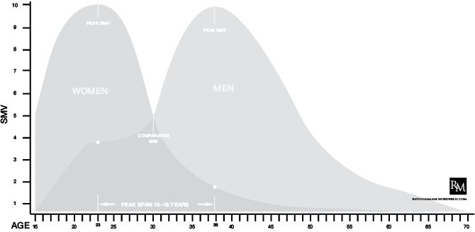
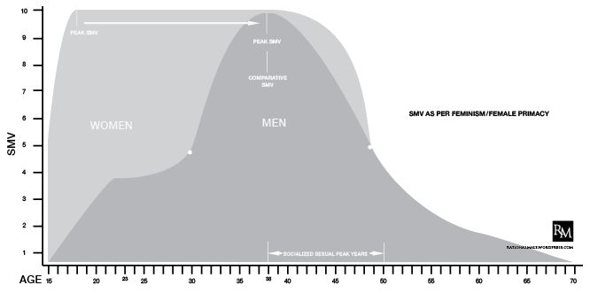

神话学

孤独是一种需要治愈的疾病吗？如果可以让男人相信这一点，那么想想从男人身上获得的潜在利润和操纵男人的可能性。

对男人的真正考验是他如何独处。

很少有人真正允许自己独处，学会真正、独特的
独立和自立。绝大多数男人（见 Beta），尤其是在西方文化中，倾向于从母亲过渡到妻子，其间很少或没有中间休息。在很大程度上，他们认同女性的命令，成为一夫一妻制的连续一夫一妻制者，从一个 LTR 到另一个 LTR，直到他们“安顿下来”，而从未学习和成熟到如何作为一个成年人进行互动。

在现代西方浪漫主义中，对孤独的恐惧被完全夸大了。在一个女人的价值取决于她的婚姻状况，并且（至少现在）同样是一个错误的前提的时代，成为“从未爱过的孤独老人”的流行恐惧神话是一个新的“老处女”神话。但在我们勇敢的新一代 AFC 中，男性（已经变成女性）被重新包装并羞愧地认为这马屎是女性角色转变的一部分。因此，我们得到了快速约会、电子和睦相处以及一系列其他“便利”，以消除这种逆转所带来的不安全感。

我将建议大多数 AFC，大多数女性化、条件反射的男性，与相似，并接受孤独老人神话，因为它是潜在排斥的缓冲。这听起来像是在拉伸吗？不应该。从女性化的角度来看，这个神话无疑是一种“羞辱”的社会习俗，其潜在功能是让男性致力于女性框架——“你最好尽快改变自己，否则你的灵魂伴侣可能会从你身边经过，你在晚年会感到孤独和贫困”。这就是神话的女性化使用，然而，AFC 对神话的内部化使用是一种缓冲。这就成为他满足于不符合标准的 LTR 或婚姻的理由；与其忍受孤独，不如嫁给一个泼妇。

这真是三重打击。有一种女性对孤独的恐惧。然后，自我强化的成熟预期或“做正确的事情”。最后，利用它作为从拒绝或潜在拒绝中的一种方便的退却；当我把它称为缓冲区时，这就是我的意思。

案例示例：我有一个朋友被困在与一个女人的毫无激情的婚姻中，她从第一天起就设定了框架。他希望在他的男性朋友面前表现出支配地位，但我们的大多数朋友都清楚，他的妻子拥有婚姻的框架。在遇到这个女孩之前，我们的朋友是个一夫一妻制的流浪汉。之前和他在一起的 LTR 女孩以几乎相同的方式主持了近 5 年的节目。当他终于摆脱了她（在我自己的帮助下），他开始意识到单身和独立的价值，并开始约 3 个月的非排他性约会。在见到他现在的妻子后，他逐渐试图找到合适的方式退出并成为排外者。他知道在如此迅速的时间范围内我们的反应会是什么，于是开始寻找各种各样的理由来实现这一点——并确定了孤独老人的神话。

他的故事是一个经典的故事，一个男人摆脱了他对女人和约会的旧思维方式，几乎与黑客帝国断绝了联系，但没能杀死他内心的 AFC，一旦他找到了另一个“灵魂伴侣”，他又回到了以前的 Beta 心态。这是一个 20 多岁的男人，他在一个悲惨的 LTR 中度过了超过一半的时间，他成功地短暂地拔掉了大约 3 个月的电源，然后又挂上了另一个。然而他的理由是“我厌倦了约会游戏。我需要安定下来。我不想在 60 岁的时候感到孤独。”这是一个只单身 3 个月的男人说的。这是他的缓冲。当然，现在他对自己的婚姻和生活充满了怨恨和沉思，他通过单身朋友过着替代性的生活，与此同时，他还自以为是地责骂他们仍然单身。

孤独老人的神话是对拒绝的缓冲。这是一种隐藏在人际关系中的行为，他们被告知必须不断努力完善，因为害怕潜在的拒绝。当他们还是单身的时候，他们就预先设定了这个想法——他们认为这是一个合理的理由和理想的目标；快点结婚，否则就太晚了。更糟糕的是，这个理由是无懈可击的。

【谚】神话的基础是与成熟相关，谁会告诉你不要变得更成熟？这就是我们如何获得女性喜欢小跑的“基多”社会习俗；“他永远都不会长大！”问题是，这种不成熟只与男性是否愿意承诺女性长期供应目标相匹配。在女性命令式的社会建构中，成熟意味着婚姻，而婚姻意味着供给。

不要相信如果你在 30 岁时找不到你神话中的灵魂伴侣，或一位的话，你会很快地去尝试命运，冒着平静绝望的生命危险。这一发明只符合女性的利益，她们必须在 20 多岁时尽可能多地吸引阿尔法人来享受他们的派对时光，然后才有一个稳定的好男人，他会过着孤独和绝望的生活，等待她们在 28-30 岁结婚，确保她们的长期安全。

不要相信这个谎言。一个对自己感到舒适并对自己真正的独立性充满信心的男人是女人们希望与之联系并分享的人。

你如何处理孤独，如何利用自由所允许的机会，才是衡量一个人的真正标准。如果你单身，50 岁，只要你有足够的勇气去探索，你仍然有选择。我知道 50 多岁的离异男人现在正在和 30 多岁的女人约会，我知道 60 多岁的男人 30 年来一直被他们的妻子困住并在情感上勒索。婚姻并不是与性市场隔绝的。

孤独老人的神话

女性与性的神话

“战利品如此强大，以至于有男人愿意为极不可能的另一个维度的战利品而自爆。没有小鸡愿意为一个阴茎而自爆。”-乔·罗根

我从男人那里读到/听到的最烦人的比喻之一（似乎比女人还要多）是“女人和男人一样/比男人更性感”的谣言。没有什么比读到这句话更能让我停滞不前了，这句话是一位谦逊的白人骑士以某种形式复述的，他试图说服自己，希望对希望，这是真的。这是一种非常有效的女性社会习俗，甚至被一些臭名昭著的 PUA 之类的人所内化和灌输。这种幻想属于更高阶的社会习俗神话，如性高峰神话。解构这个神话所需要的只是女性生物学的基本知识。

女人比男人更性感，但她们会因为社会或对男人缺乏“信任”而受到压抑。

显然是假的。健康男性产生的睾丸激素是女性的 12 到 17 倍。从生物学角度讲，女性不可能像男性一样，或像男性一样频繁地想要性生活。相信当一个女人说，“我不明白为什么性对男人如此重要”时，她说的是字面上的事实。没有一个女人会经历 17 倍于她自己的睾丸激素水平（类固醇除外）。在众多其他效应中，睾酮是刺激人类性欲的主要激素。我还应该补充一点，平均而言，除去环境因素，男性 40 岁以后的睾酮水平每年仅下降 1%，因此，即使在 60 岁时，健康男性的睾酮水平平均也只有 20%。

批评者认为，对于女性性反应和觉醒，睾酮不是唯一考虑的因素。我同意，但这是性反应中的主要因素。一个女人不可能理解如果不使用类固醇的话，她们体内 12 到 17 倍于目前水平的睾丸激素会是什么感觉。事实上，女性健美运动员在循环合成代谢类固醇时报告的第一个效应是性兴趣和性欲增加 100 倍。因此，就女性的自然荷尔蒙/生化反应而言，没有一种不变的方法可以准确地将女性的性欲基线与自己的性欲进行比较。

女性的性欲也是周期性的。即使在排卵周期的高峰期，也就是她性欲最旺盛的时候，她永远不会经历男人一天 24 小时所做的事情。这是神话的根源，也是社会习俗的根源。

与男性一样，女性一生都依赖睾酮维持性欲、骨密度和肌肉质量。对男性来说，雌激素只是降低睾丸激素，减少肌肉质量，阻碍青少年的生长，引起女性乳房发育，增加女性特征，降低前列腺癌的易感性。性欲取决于雄激素水平而不是雌激素水平。

我也明白女性性行为的功能不同于男性性行为，但这只是强化了我的观点。女性的性行为是周期性的，不仅是在每月的时间表上，而且在一生中（例如更年期和生育高峰）。从青春期到 40 岁左右，（健康的）男性的性欲在一个月和一生中会有起伏。女性唤醒的速度较慢，她们往往需要的不仅仅是视觉刺激，而且肯定需要
心理因素（她们需要幻想）。男人只需要视觉刺激和最低限度的反馈就能激起性欲（即色情）。

绝经后激素疗法也使用睾丸激素来提高女性萎靡不振的性欲，这并不令人震惊。当女性处于排卵周期的高峰时，睾丸激素水平会急剧上升，以促进怀孕，然后在月经期间被排出体外。你可以讨论如何最好地让女性的睾丸激素流动，但需要睾丸激素来促进性反应。

现在真正的问题是，为什么如此流行的神话会成为如此有用的社会习俗？想想看。它使女性性感化，而不是让她们成为彻头彻尾的荡妇。他们可以避免滥交的污名，同时表现出一种幻想，即他们秘密地“比他们被允许的”更性感，只要他们能遇到一个足够熟练的男人，把这一点表现出来。

这是一种性别选择惯例。幻想的是，女人真的是这些披着羊皮的狼，适合合适的男人。在某种程度上，这是正确的。研究确实表明，处于生育高峰期的女性事实上会积极寻找阿尔法男性进行常规性接触，尤其是在月经周期的增殖期。然而，这一社会习俗的根源再次在于“妇女与男子一样具有性”的假设，考虑到女性性反应所依赖的条件，这一假设根本不是事实。

没有一个自私自利的男人会被鼓励去反驳这样一种观点，即女人和男人一样被性所占据，同样被性所唤起，或者同样渴望性。我们喜欢这样的幻想：如果社会更加开放和接受女性的性行为，女性会暗暗渴望与我们发生性关系。然而，与此同时，我们将听到，在西方社会被同样的男人抛弃的过程中，女性变得多么放荡和好斗。这很讽刺，但这给了男人们希望，如果他们能找到释放每个女人体内性欲的秘密公式，他会发现这个贪得无厌的女妖可以和一夫一妻制的女人配对。如果女性与男性在性方面是平等的，为什么她们不会倾向于与一夫一妻制相冲突的同样的动机呢？想象一个女人和男人一样性感的世界。想象一个同性恋浴室，你可能会有一个可行的模式。

女性当然喜欢鼓励和强化这种社会习俗，因为这听起来像是在父权制的性压迫面前赋予权力（是的，如果你只允许我们与邪恶的男人交往，我们会更性感），同时也默认这一点，使男人成为白人骑士事业的同情者（即女性权利和首要地位）。

我开始这个话题的目的并不是要辩论女性是否具有性——很明显，她们具有性——但我的意图是提请大家注意一个谣言，即女性（及其潜在的男性身份识别者）希望每个人都相信，“女性与男性一样/比男性更具性”。没有一个女人能对此做出现实的评估，除非她体内的睾丸激素水平增加了 12-17 倍，并且生活在一个男人的生理条件下。从表面上看，这种说法很愚蠢，但正如我所说，对于女性来说，认为女性与男性“同样性感”是一种授权。而且
女性识别者都非常乐意强化这一模因，因为它为她们提供了与这些“性压抑”女性之一发生性关系的希望。

理性的男性

好女孩就是坏女孩，永远不会被抓住。

请允许我在这里讲述一个案例研究，大约 6 年前我亲自给一位朋友提供咨询。我有一个非常好的朋友，里克，我雇佣了他，并和他一起工作。虽然我们一开始是同事，但他成了我的一个好朋友，而且得益于我个人将他从矩阵中拔出。他是一个好学生（因为没有更好的学期），但在成为好学生的过程中，他经历了一个转变过程。像大多数男人一样，他一辈子都在受女性的制约，他傲慢地接受了我最初教他的东西，但私下里，他仍然坚持自己的 AFC 心态。也就是说，直到转折点到来。

在我不知道的情况下，里克与一位我们合作了一段时间的半漂亮公关女孩建立了一段轻浮的“友谊”。他知道我对 LJBF 的拒绝和和女人“玩朋友”说了些什么，所以他把我排除在整个事件之外。他曾多次与她“约会”，但除了偶尔的“酒后接吻”之外，她还使用女性经典的标准阻挠技巧让他保持距离——“我还没准备好谈恋爱”、“我没找男朋友”、“我们是好朋友”，然而，她确实把他留在了自己的“注意力网”里，并对他施加了一点爱意，让他拉着她的车大约 3 到 4 个月。请注意，瑞克从来都不是傻瓜。他曾经和他那一部分的女人勾搭在一起，但这个可爱的“好女孩”充其量只是一个 HB7，对他来说却发展成了一个性感的女孩。

一天晚上，当艾伦·刘易斯（是的，来自斯坦德）在我们的赌场表演独唱时，她不得不和他一起做一些工作，这一切都达到了高潮。长话短说，这名公关小姐在今晚突然出现，在正确的阿尔法、正确的环境、正确的条件下，与亚伦·刘易斯的巡演经理发生了性关系。她的错误是觉得有必要向里克坦白自己的行为，考虑到里克在做他认为正确的事情时投入的所有投资，里克感到被背叛了。有一天晚上，一个男人因为“他很热，我喝醉了，一件事导致另一件事”而与他 3-4 个月的个人投资（即关系股权谬论）发生了化学反应，她和他做爱。

这当然是他咨询我并告知我导致此事的一切的时候，只是现在他陷入了僵局。她向他大量道歉，并（再次）伸出橄榄枝表示拒绝 LJBF。他问我他应该说什么，这时他主动告诉她“不，我们不能‘只是做朋友’。”他按照我的建议做了，这是他有生以来第一次离开一个女人。就在这时，她陷入了困境。她以前从未遇到过这样的回答，所有的卡片都直接落入了瑞克的手中。她总是在酒吧或活动中“撞到他”来“再谈一次”，她对他的态度完全是 180 度，都是为了“成为他的朋友”。

现在我特别为瑞克感到骄傲，因为与大多数人发现外卖的真正力量不同，他坚持外卖，而不是满足于她追他，然后向 LJBF 屈服。事实上，他已经学会了一个现在仍在使用的有价值的工具——外卖的力量。

此外，他也开始理解理解女人的原则，不是通过她说什么，而是通过她做什么（媒介是信息）——他学会了阅读行为的重要性。当然，在大约 6 到 8 个月后，她不再追求他“做朋友”，在这段时间里，他与她交谈过，但他们的谈话框架已经改变。她尊重他，这是他成为
追击者时从未有过的，如果他向另一个 LJBF 投降，她也不会有这种尊重。

好女孩

每当有机会的时候，这个女孩都喜欢展示自己的“得体”，当被问到她想要一个什么样的男人时，她总是说“想要一个心地善良的男人”。她非常外向，适合做公关人员，但她总是把自己表现为一个意识到人们如何看待她和她的声誉的人。她是一个典型的基于行为而非言语的评估案例。生物学压倒了信念——性，尽管我们认为我们可以，也不会不表达出来。独身的牧师，道德保守的政治家，和纯洁如雪的贞洁的女孩，你有一个所有人都想下车，他们会找到这样做的方法。据脸谱网报道，她现在住在蒙大拿州，有一个完全测试版的丈夫，他可能不知道她有能力进行原始的、野性的超亲行为。

男人认为女人是“好女孩”的其中一个特征是，他会有一种默认的倾向，让她坐在自己的位子上。白人骑士是天生的，但即使是铁石心肠的普亚人也倾向于更多地了解“好女孩”的性格。一个可爱的 HB8“好女孩”是 ONEitis 的秘诀，因为她似乎不受诱惑。

“我只想要一个心地善良的男人”听起来非常童话般完美，加上恰到好处的天真，她以一个真正相信迪斯尼愿望真的会实现的女孩的形象脱颖而出
。对于玩游戏的男人来说，她是在新的勾搭模式中的卑鄙女孩中的一颗宝石。对于白衣骑士来说，她是一个原型——一个无辜的少女，在这个世界腐蚀她的灵魂之前，她需要从这个世界上被拯救出来，她变成了所有其他不愿与她们约会的女人。当她自发地与一位阿尔法巡回赛经理发生性关系时，他们两人同样感到震惊。

如果您还没有这样做，我强烈建议您在阅读列表中添加罗伯特·格林的诱惑艺术。在这部开创性的作品中，他首先描绘了诱惑者的原型，在这些原型中，我们发现我们的“好女孩”真的是天生的；孩子般的天真，掩盖了诱人的动机。你可能倾向于认为一个好女孩是一个拘谨的人，但这往往是错误的。好女孩需要有足够的诱惑力和可爱，让她的超多情为她工作。任何边缘的拘谨都是为了让追求者在足够长的时间内处于停滞状态，以评估更好的选择，或者对于我们的公关女孩来说，是利用即时阿尔法体验的选择。

好女孩的游戏是围绕着男人心中的“优质女人”神话而建立的。他们想相信，她生活在一片死气沉沉、自私自利的荡妇海洋中，希望在撞墙前赚大钱。她不是拘谨的麦当娜，也不是巴比伦的妓女，她是介于两者之间的可爱的好女孩。她只是一个 HB7-8，而不是半女神 HB9+，因此她也散发出诱人的潜力。所有这些都是一种非常理想化的、非常固定的 ONEitis 形式，直到它被图形化地驱散，让患有 ONEitis 的人感到痛苦。

就像所有男人都有某种形式的游戏一样，女人也有自己的游戏。因为我们生活在一个女性定义的现实中，女性的游戏不被认为是借口，它仅仅是女性的本来面目，或者女性的神秘感。一个好女孩与“其他女孩”形成对比的原因仍然存在于这种女性社会规范之中。

聪明的游戏实践者知道什么对他最有效，但他也必须意识到游戏对他不利。娱乐性掌握原则最重要的一个方面是，实际上掌握了被娱乐的能力。这听起来可能有点神秘，但它意味着有经验知道女性游戏会带来什么，掌握它，并能以有趣的笑声回应。

例如，女生游戏的操作目标是最大化席上游戏，这是游戏的基础。所以知道了这一点，你就可以对女人对你使用的任何诱惑方法做出有趣的反应。好女孩仍在寻找阿尔法，如果有机会，她仍会停下好女孩的车下车去干他。当你和一个好女孩打交道时，或是她姐姐的任何一种方法，你都会看到他们是从目的开始的。

好女孩的神话

流行文化喜欢教育女性，通过联想，教育无知的男性，每个女性体内都有一个天生的生物钟，慢慢地进入一个神奇的
时期，在这个时期，她的母性本能最终使她倾向于想要一个孩子。
也许，这并不奇怪，这与女性性高潮的神话完全吻合，同时也恰好是大多数女性撞墙之前或之后的人口年龄。

从表面上看，生物钟的概念听起来很有说服力——它是“生物钟”，当谈到女性的社会习俗时，没有什么比她们的身体、她们的自我更能让女性信服。在女孩的世界里，对于男人的不良行为，生物学的推理总是可疑的，但当适用于女人时，生物学就是“自然之母”，你不会和那个婊子争论。

不幸的是，正如命运所安排的那样，生物学的硬科学往往会与女性的社会习俗一刀两断。你瞧，许多女性低估了生育时钟的叮当声。2011 年，NPR 播出了一篇同名文章。女性实际生育窗口的冷硬科学似乎与女性至上的信仰条款并不完全一致：

一项新的调查发现，在生育率方面存在很大的脱节。女性认为自己能怀孕的年龄与她们的身体实际能怀孕的年龄相差甚远。这造成了一个日益严重的问题，因为越来越多的妇女比以往任何时候都要等待更长的时间来生孩子。

一个 30 岁的孩子一次怀孕的机会有多大？许多人认为这一比例高达 80%，而实际上不到 30%。对于一个 40 岁的人来说，许多人认为成功率高达 40%。实际上不到 10%。当你继续努力的时候？调查发现，许多人认为怀孕的速度比实际发生的要快。这也表明许多女性低估了生育治疗的成功程度。

关于生物钟的神话不仅在女性何时怀孕方面不准确，而且在怀孕几率方面也存在危险的误导。

“他们说的第一件事是，‘为什么没人告诉我这个？’”芭芭拉·科格拉说，她是这项调查的合著者，也是国家不孕症协会 Resolve 的负责人。她感到遗憾的是，没有任何联邦机构推动这一问题，妇女和她们的妇产科医生也不愿意提起这一问题。尽管如此，科勒拉承认生育率下降是一个难以传达的信息。

“说实话，女人们不想听到她们不能拥有一切，”她说。“我们可以有一份好工作，我们可以有一个硕士学位，我们不需要担心生育问题，因为这是会发生的事情。当事情没有发生时，女人们真的很生气。”

我不会说女性实际上拥有母性本能，我会说她们对自己何时表现的
理解被以女性为中心的文化影响故意扭曲了。如果女性对她们在后墙生物条件下无法怀孕或难以怀孕的事实表示“愤怒”，那么她们的愤怒就被误导了。他们不会从自我投资的女性赋权心理学的令人陶醉的基座上走下来，而是会责怪男性不是合适的父亲，或者缺乏“按规则行事”的意愿，将时间浪费在色情和电子游戏诱发的昏迷中。

电影制片人莫妮卡·明戈（Monica Mingo）在博客中讲述了她长达十年的受孕努力，她说：“我只是觉得他们把一些事情强加给了我们无法控制的女性。”。她说，真正的问题是整个社会，这将推迟人们安顿下来生孩子的年龄。明戈直到 32 岁才见到她的丈夫。

“你告诉我们，你的生育年龄在 20 多岁左右迅速下降，”她说。“好吧，如果我没有和任何人约会，我想有一个家庭，那么这些信息对我有什么作用？”

首先，当你意识到自己想要孩子时，它可能会迫使你接受你想要为未来生活设定的方向，做出明智的选择，而不是把责任推到所谓的“基多”男人身上。我想当你在电影学校的黄金派对上时，这要求太高了。对不起，莫妮卡，时间到了，你在墙前的几年确实控制了它。所有女权主义的憔悴幽灵都在地狱里沸腾的善意大锅周围尽情地咯咯叫着。

我们在这里看到的是超群众生和女性至上的碰撞，打破了生物学的严酷现实。女性的迫切需要创造一种新的社会习俗，使这种不协调的现实与其教义相一致。这是以前用性流动性的方便改造做过的。指责男人不遵守“拥有一切”意识形态的原则，并创造一种便利的新社会习俗，在其对自身造成的问题的复古解决中羞辱男人。

如果真有生物钟的话，那么当女性在 22-24 岁时，生物钟的滴答声最响，而当她最需要男性供应时，以及当她的性市场价值在她三十多岁时下降时，生物钟的滴答声就不那么方便了。

生物钟的神话

“你的防弹游戏和迷人的个性不会让你脱下衬衫时看起来更好。”

表情。

资产。

游戏。

有两个。三个是最好的，但如果你只有一个，游戏是最重要的。

我意识到我正带着这一点走向危险的领域，但我坚持认为相貌是吸引力的一个组成部分——对不起，这是生活中的一个事实——但我从未说过相貌会取消比赛。事实上，我主张学习游戏和保持良好的体格是同样必要的。

问题在于那些只能以绝对方式思考的人。这总是一个非此即彼的命题；游戏胜过体质或体质胜过比赛是马屎。他们两个都很重要，而且彼此都有竞争。有很多长相平平的家伙，不管他们的长相如何，都会因为游戏而拉扯尾巴，也有一些长相英俊的家伙，他们拉扯尾巴却从来没有听说过游戏是什么。但你不想成为两个都有的人吗？那个能拉女人而不弥补个人缺陷的男人？

考虑到在西方社会中超过 66%的人超重（33%是病态肥胖）。因此，有三分之二的人为了改变自己的生活、前景和性前景而寻求加入社区，他们从一开始就要与肥胖作斗争，这是理所当然的。现在也考虑男人之间的偏好信念，至少在女性吸引力方面看起来比个性、游戏等更重要。这是而不是的巧合。对这些人来说，改变他们的身体比改变他们的思想需要更多的努力。

“相貌对女性来说并不重要。”

大多数以前身体不好的男性会告诉你的第一件事是，他们在身体好了之后，从女性那里得到的关注显著增加。这也许是最简单的实验，可以证明这一断言是错误的。*

男人们普遍存在一种误解，认为“相貌对女人来说并不重要”，如果一个男人机智，他们会更宽容地多胖几磅，

幽默和/或体现了他们在网上约会档案中列出的一系列毫无意义的形容词的组合。这是男性版的身体形象接受社会习俗女性在过去 50 年里一直在宣传自己。不要担心塑形；金钱、幽默和自信会让任何女人为你着迷。如果真是这样的话，世界上的路易·安德森和丹尼·德维托斯（Danny Devitos）会穿着上流社会的屁股游泳。我毫不怀疑，非常富有但身材不好的男人在吸引女人方面相对容易，但他们不能让一个女人真正想在身体层面上和他做爱。这只是谈判欲望的商业版本。

虽然这似乎是一种男性特有的社会习俗，但请再猜一次；这实际上是一个精心设计的女性惯例。就女性繁殖策略和
女性的交配时间表而言，女性在性生活能力高峰期与阿尔法男性进行短期繁殖策略更为有利，因为她知道有一个社会结构可以适应她的长期繁殖策略（即供应）和未来的男人。换言之，鼓励男性认为“相貌对女性不那么重要”，这样他们在短期内与体现其特定身体理想的男性一起繁殖时，将成为更可接受的未来提供者。这正是为什么“kidult/man up”现象让当今女性如此烦恼的原因——它威胁到了这一长期战略。

优先级

根据女性的性策略，女性根据自己的生活阶段重视容貌。女性优先考虑亲密关系的先决条件和重要性。

14-24 岁：外表是一切。是的，一些浪漫主义可能有助于完成幻想，游戏无疑是一个因素，但唤醒的优先顺序主要是达尔文的。当女性接近自己的性顶点时，她们会乐于忽略性格缺陷或缺乏资产而与身体上的阿尔法做爱。对于这方面的一项杰出研究，请花时间阅读 Martie Hasselton 博士的研究，为什么肌肉发达与理性男性的性感有关。

25-30 岁：相貌仍然是最重要的因素，但随着她越来越意识到即将撞墙，其他因素开始在重要性上竞争。虽然她仍然很热，足以引起人们的注意，但她的超亲和力优先考虑的是男人一生的供应潜力和父母的投资潜力。当她接近 30 岁时，她知道如果她想在仍能与其他女性竞争的情况下从游戏中获利，就必须好好玩牌。雄心壮志、性格、资产、幽默、个性等在潜在的终身承诺中开始变得更加重要。

30-35 岁：在这一人群中，大多数单身女性都有不同程度的否认（社会习俗的帮助），但在某种程度上，她们意识到自己已经过了有效期，要获得承诺每年都是一场越来越艰难的战斗。看起来失去了有利于资产和地位的先例。游戏和个性变得更加突出，但主要关注点是她在 28 岁左右做出（或应该做出）的选择。锁定一个
已被证实的商品——一个拥有相当数量成功和地位的人——是现在的目标；不是一个有“潜力”获得同样成功的人。虽然身体状况仍然很重要，但如果这个男人能带来很多东西，她更愿意在 24 岁时保持的身体标准上妥协。

35-45 岁：她已经过了有效期，撞到了墙上，不管有没有礼貌，她都接受了自己是二手货的事实。任何关于必需品或优先事项清单的概念现在都是一段美好的记忆。她可能会玩美洲狮牌来保护自己。这看起来像是她在扮演美洲豹时又回到了她最初的容貌焦点，但在某种程度上，她明白年轻男人们通过和她做爱是在帮她忙，而且绝不会期望更多的是肉体上的放纵。奇迹般的是，人们仍然希望将一位年迈的 AFC 离婚者锁定在一个不利的位置，至少拥有一些可观的资产。地位很好，如果他还拥有容貌的话，容貌将是锦上添花，但资源调配比游戏或社交智能更重要。

做出改变

改变自己需要付出努力。变革中最大的障碍是第一个；认识到并接受你需要改变的事实。这是 AFC 和 Beta 雄性狼吞虎咽的地方，因为他们在一生中的大部分时间里都被告知“做自己”，一切都会按照命运的计划进行。然后，不管出于什么原因，他们从矩阵中拔出足够多的插头，意识到他们已经被卖了一张货物清单，个人改变对他们来说是必要的。他们需要改变他们的生活方式，改变他们的态度，改变他们的观点，改变他们对自己的看法，是的，也要改变他们的体格。

但改变需要努力，人是懒惰的。他们想要快速解决；让他们快乐、成功、性不可抗拒的神奇药丸。因此，他们蜂拥而至的是那些销售最好的程序的人，这些程序承诺以最小的努力实现所有这些。学习游戏需要经过实践的努力，但它所需要的体力远比提高身体素质少，而且对于不习惯运动的人来说尤其令人望而生畏。这需要时间、精力和奉献精神，所有这些都与那个家伙一开始的状态相称。

有无数的“胖乎乎的追逐者”网站致力于迎合男性的这种特殊“恋物癖”，但没有一个是针对女性的，为什么？我的意思是，社会上有一定比例的健康男性追求肥胖女性，但由于肥胖男性缺乏恋物癖，女性的理想男性气质标准似乎保持不变。社会上有这样一种需求，即男性寻求肥胖女性，为了满足这一需求，已经发展了一些企业，但对于寻求肥胖男性的健康女性（或不足以注册的女性）来说，没有类似的需求。

你认为这是为什么？历史上从来没有男人过胖的时期，超重男人被认为是女性的理想。肌肉发达的体格一直是男性的标准。

男人为女人定义了什么是女性和性感，而反过来，女人为男人定义了什么是男性和性感。女性之所以发现男性生理学中的某些方面会引起性唤起，是因为过去那些体现了性的男性往往会得到性的奖励，从而使这些特征在女性大脑中成为心理子程序。

是的，游戏是至关重要的，就像根层次、动态的个人变化一样。我不认为我需要解释这有多重要。然而，看起来计数，看起来很重要。

我发现令人惊讶的讽刺是，长相是男人直接控制自己身体的少数几个变化领域之一。除了身体残疾，你没有理由不保持良好的状态。你为什么不想要完整的包裹？别这么懒了，承认你需要付出一些努力和汗水来让自己更具吸引力，更能吸引女性。游戏和积极的男性心态对你的吸引力和幸福感至关重要，但它们不会让你脱下衬衫看起来更好。

*旁注：我还应该指出，尽管女性会断言男性阴茎的大小与性快感无关，但通常她们为了羞辱男性而对男性的第一个侮辱是“我敢打赌他有一个小弟弟！”你把这些点连起来。

男性容貌的神话

自从我写关于性别问题的文章（10 多年）以来，庄园里充斥着详细介绍性市场（包括我自己的市场）以及女性短期和长期性策略对她们的影响的文章。这些分析从生物学后果到社会化的女性至上主义（女权主义者）对谦逊的男女成员施加的阴险、破坏生命的惩罚。这种现象的最新表现是“男人站起来”的社会“羞辱”努力！2.0 主流媒体的大众化。

是的，我对不止一次地破解这个话题感到内疚，但值得重复的是，女权主义、平等主义和女性主义是如何合力重塑女性的性市场价值的。

SMV

在浏览 SMV 的过程中，我对 SMP 的布局以及与每种性别相关的性市场价值进行了初步概述。虽然我开始时有点开玩笑，但我非常认真地试图从视觉上勾勒出一个人的生命时间线可能是什么样子，如果他或她有一个“上帝的眼睛”的视角来看待他们的 SMV 何时会达到最高点，何时会建立，何时会消失。正如我在键盘上输入的所有内容一样，我的努力是找到 SMP 的真实核心，以及我们生活中发生的事件如何与这一估价相符。这里再次出现故障：

这是一项努力，旨在定义一种当代的、现实的观点，即两性市场价值如何波动。我认为这是相对反思性的，如果有点粗糙的话，但是我
从男性的角度来处理这张图表，因为它的目的是教育男性在以后的生活中他们的 SMV 潜力，并据此进行规划。

我没有解释的是女性化对女性（以及男性协会）对自身 SMV 的集体理解的影响。鉴于 manosphere 的大量文章致力于女性对其性市场价值的扭曲和误导性解释，我认为这已经是至死不渝了；我花了一点时间来消化一个新的想法。

女人喜欢男人

就好像在暗示中，红队从一条评论线索中发泄他的沮丧：

“从长远来看，为什么金钱对这些女性来说更重要，因为他们中的大多数人似乎都把事业放在首位，把婚姻/孩子推迟到晚年？约会世界似乎被 30 岁以上的职业女性污染了，她们已经在旋转木马上坐了 10-15 年，现在已经准备好结婚了“安顿下来”
在 40 岁高龄时生下 2-3 个孩子。这些女性似乎忘记了晚年生孩子的更大风险。”

我发现这个评论恰到好处，因为它总结了我对生物钟神话的看法：女人想成为男人。这是自格洛丽亚·斯泰纳姆（Gloria Steinem）自己结婚、干涸并被吹走后，一种腐朽的女权主义社会动力给一代又一代的男人和女人留下的遗产。女人需要成为明天的男人。我想我以前应该看过这个消息，老实说，我认为女性化思维的大部分都是围绕着角色转换的，但这不仅仅是角色转换。女人想要成为男人。

如果一个人可以等到成熟，他的成就就会更现实，他的 SMV 在 38-40 岁时达到顶峰；平均主义说“你为什么不应该做男女生？”

无论是在性关系不稳定的情况下，还是在尊重或社会权利方面，女性都希望成为男性。这就是 60 多年来女性化所教会女性的宝贵之处，也教会了男性如何适应。事实上，男人因为没有向女人伸出“手”让男人成熟而被称为“小男人”。在这方面，女性化是阴茎嫉妒的最终形式；使连续几代愿意将女性男性化的男女文化融合在一起。这是女性命令和女性至上的核心。

过度多情和女性的先天心理自然与这种社会化
努力相冲突。因此，我们让女性期待男性的平和，同时又觉得自己有权享受传统女性的礼貌和期望。这就是“拥有一切”的意思。为了女性至上的利益，如果可行，就使用它。

因此，在想要像男人一样的愿望中，一种大众化的平行方式必须被社会化到女性对 SMV 期望的集体理解中，这一点应该不会令人震惊。在最字面的意义上，如果男性可以享受更进步、更成熟的 SMV，那么根据平等主义的
理论，“新”女性也应该能够反映男性的 SMV。

SMV 女性化

通过女权主义、女性至上及其必要性的共同努力，女性已经被社会化和文化化，相信她们的 SMV 特征包含并与男性同步。由于女性本质上是男性，平等主义（女权主义的宗教）让女性相信她们的 SMV 时间表至少应该与男性相同。

我本可以简单地从我之前的 SMV 图中回忆男性钟形曲线来说明 SMV 女性化的重新定义，但这并不准确。除了男性化的 SMV 女性化已经使现代女性确信，这并不能解释女性在其真正的性高峰期（22-24 岁）所期望享受的明显好处。

我确实发现有一件事需要解释，那就是性高峰的神话。正如红色团队所哀叹的，在我的《生物钟的神话》一文中，这种女性定义的错觉似乎接近女性的后墙评价。由于男性的 SMV 通常在 38 岁左右达到峰值，女性需要一种社会习俗，使她们的性高潮与男性一致。因此，我们阅读了无数关于性高峰的文章，这些文章将老年女性的性能力提升到 22 岁“女孩”男性明显更喜欢性伴侣的水平之上。平均主义强化了这样一种错觉，即如果男人在生命的后期处于最理想的状态，那么男人也必须如此。

墙体裂缝

尽管它努力说服女性重新定义 SMV 的女性化，但在旨在确保持久女性主导地位的社会结构中，已经开始出现明显的裂缝。自从婴儿潮一代掀起最后一波重要的女权主义浪潮以来，连续几代的女性现在才开始意识到“拥有一切”谎言的严重性。

性别至上（伪装成“平等”）的制度在很大程度上，而且非常明显，与女性真实的性市场价值及其发展相矛盾。尽管如此，女性的迫切性从来没有有效地对抗导致 SMV 的生物
动机——随着女性年龄的增长，女性的主导地位成为其自身超群性的受害者。因此，当务之急必须不断地重新定义其使命，创造新的社会习俗，并依靠将自身的不足归咎于它所征服的人。

女性现在意识到她们真正的 SMV 并不是女性化让她们相信的太晚了——墙上的一道裂缝。另一种策略是让男性感到羞耻，因为他们不愿意参与女性命令定义的 SMP，并期望他们参与。“你们这些幼稚的孩子，振作起来！”墙上又出现了一道裂缝。

许多女权主义作家都能在她周围形成一个繁荣的事业和名人
无法接受她真正的 SMV 和 SMV 模式之间的冲突女性的命令已经限制在她的自我中，这是对被扭曲的范围的控诉，女性化的 SMV 模式已经渗透到女性和我们的文化中。

女性 SMV 的神话

一般来说，任何一种性别的人都不喜欢为自己定义爱情。爱的概念充满了主观性，毫不奇怪，如果你试图将人们对爱的想法放在一个明确的盒子里，你会冒犯他们的理解和情感。这就是为什么爱是如此伟大和人性化的理念之一，但它的模糊性也是我们经历的许多人类悲剧和苦难的主要原因。

我们在宗教背景、个人解释、哲学论文、
生物动力学和其他一系列领域中看到爱，因此很容易理解爱是多么普遍地复杂、操纵，同时也很容易理解爱是如何根据它的好坏来约束和培育的，或者我们的爱情观与他人的爱情观有多么不一致。

在概述（而不是定义）男性对爱情的看法时，与女性的看法相比，有必要了解男性对爱情的理解随着成熟而发生的变化。许多理性的男性评论者想在他们与母亲的关系中找到这种观念的根源。虽然这听起来像弗洛伊德主义者，但我不会说这是一个坏的开始。事实上，男人们从他们的母亲身上学到了亲密、身体和养育爱的最初印象，这就形成了他们潜在的妻子（或爱人）所期望的爱的基础。即使孩子们不能抽象地思考，也有一种与生俱来的、基本的对条件性的理解，为了维持母爱，必须满足这些条件性。约哈米在静物脸实验中展示了这一点。

评论员约哈米（Yohami）将此打破：

在我们学会说话之前（在我们能够形成抽象概念之前），电路就被打印出来了。这是一个基本的四段式情绪/行为回路。

有很多种方式可以将电路标记为“错误”。一种是让母亲（或父亲）在接受端，让孩子成为给予者。另一个是让他拥有这个框架。另一种是让妈妈（或爸爸）只在孩子表现出来时才做出反应。另一种是让孩子表现出来，然后让他沉默/惩罚他。不久，孩子理解了游戏并开始玩。

然后你把所有的东西都建在上面。

你从 12 岁到 21 岁的经历当然有助于形成你，因为你现在 35 岁了，这是一个累加的游戏。但老实说，从 12 月到 21 日发生在你身上的事情与已经发生的事情是一样的，只是增加了外部世界的影响、性欲和额外的压力。

我试图找到痛苦的根源，是这样的：就像一个罗盘或一个几何体想要找到平衡，痛苦想要再次找到“好”（从好到坏，从丑），但它只知道到达“好”通过暴力地平衡坏的和丑陋的以及愤怒的事件，如果这不起作用，分裂/自残（切断你不想要的部分、你的过去、身份、情感、人、关系、屏蔽东西等）

这是一个不断寻找难以捉摸的“好”的动态部分。

约哈米继续：

【但是】你对自己的需要和欲望没有信心/自信，因为你还在谈判如何让自己感觉“好”和安全，所以你没有开发游戏，也没有看到女孩/关系是什么样的——但你只是将这一点添加到了之前未解决的组合中，比如，寻求“好”（基本的、母爱的、父爱的，你是毫无防备的，你被亲密地爱着、照顾着、安全的）来自女孩，混合了无防备的、性侵犯的冲动、长期的感情渴望和永远感觉不到安全的绝望感等

从我们出生的那一刻起，我们就意识到爱是有条件的，但我们希望它是无条件的；我们的理想状态是无条件的爱。作为一个男人，就是要表现出色，成为一个在欣赏和崇拜中自由表达情感的人。

在基本层面上，正是这种对理想化爱情状态的不断追求，帮助我们变得比开始时更多，但这是以错误的信念为代价的，即女人有能力，更不愿意像我们认为可能的那样爱我们。

休息的地方

评论员 Peregrine John 总结道：

我们想放松一下。我们要公开和诚实。我们希望有一个安全的避风港，在那里斗争没有立足之地，在那里我们获得力量和休息，而不是让它从我们身上消失。我们不想一直处于戒备状态，只想有机会和一个能够理解我们基本人性而不吝惜的人在一起。停止战斗，停止游戏，只是一段时间。

我们非常想这样做。

如果我们这样做了，我们很快就不能再这样做了。

这是一种认识，男人只有在与女人建立“爱情关系”时才会做出决定。对于男人来说，这是（应该是）超越理想化的无条件爱的渴望而成熟的催化剂。在这一点上，他们完全明白，他们希望能够回归（或可能回归）与母亲的概念性爱并不存在于他“爱”的女人身上，最终，从婴儿期到成年期，他与母亲之间从未真正存在过。

表演中没有休息，没有喘息或暂缓，但对无条件爱情保证的渴望如此强烈，以至于男人们认为将其写入“传统”婚姻誓言是明智的——“无论好坏，无论贫富，无论疾病还是健康，爱、珍惜和服从，“至死不渝地抛弃他人”——换句话说，这是一种无条件的爱的承诺，不管发生什么情况。这些誓言是针对女性超群众生的直接保险请求，如果不是在上帝和男人面前做出的，这些超群众生将不受约束。

在之前的文章中，我提到了一个 65 岁的 y.o 男人，我曾经为他提供过咨询，他的妻子在感情上勒索了他 20 多年。他以前结过一次婚，12 年后因为“没有达到她的期望”而与第一任妻子离婚。他从未意识到与他“相爱”的女人对爱的含义有不同的理解。更确切地说，他将他先前的爱的概念发展为与他“爱”的女人相匹配，因此他的爱的概念是基于对那种爱的无休止的追求。在他第二次结婚的第一年，他失去了工作，失业了大约 5 个月，留下他的妻子作为他们唯一的收入来源。在失业的第四个月末，他从面试回来，回家后发现家里的锁换了，两个“装满了他的大便”的行李袋正等在门口。最上面是他的第二任妻子写的一张便条，大意是：“在你有工作之前不要回来。”

我记得当时他自豪地向我讲述了这个故事，因为他说，尽管当时他很生气，但他“感激”她踢了他的屁股，让他成为一个“更好的男人”。至此，他的爱情观已经完全改变，从他与第一任妻子几乎相同的经历转变为完全依赖于他赢得妻子爱的能力的模式。为了爱而无条件爱的理想化已经一去不复返，取而代之的是他新妻子的战术性、机会主义的女性爱观念。而且，他对此很感激。

20 年后，65 岁（现在 69 岁）的他开始意识到，他为无限期地获得她的“爱”所做的努力从来没有得到过赞赏，只是意料之中；因此，在这里，他面临着非常残酷的现实，他正在失去健康，因此，他有办法保持对她的爱和感情的持续资格。

对账

我收到了很多电子邮件和信件，都是关于我那篇具有开创性的战争新娘文章的无情。男人们很难接受女性与生俱来的与自己的俘虏者建立联系的能力的非道德性，这是一种心理-社会适应的生存特征，这是如何演变成女性明显的能力的，她们可以比男性更快地“摆脱”前情人。

女性不喜欢我详述这种现象，原因很明显，但我认为男性

不喜欢他们容易“处置”的概念，因为
对爱情的性别概念同样不一致。即使是殉道者，即使是在死亡中，这种无条件的男性爱的概念也受到女性必然的、流动的和功利的爱的概念的谴责。
接受这是服用红色药丸最困难的方面之一。

我明白这似乎过于虚无主义，但这就是重点。接受红色药丸现实的所有非常积极、非常有益的方面都是以放弃我们长期以来习惯的蓝色药丸理想主义为代价的。离开波利亚娜，
期待中的蓝色药丸梦似乎要杀死一个老朋友，但忘记那个
旧范式可以让你受益于一个更有希望的红色药丸存在。

我不是在争论女性爱的能力是否真实或真诚。我在这里的假设是，女人的爱情观并不是男人会相信的。

爱与战争